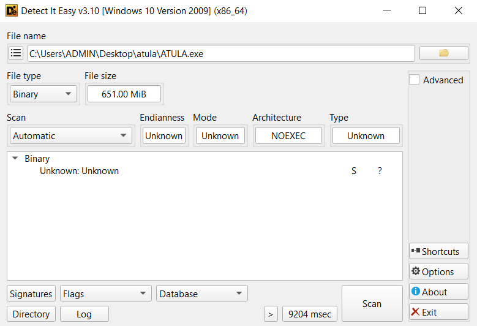
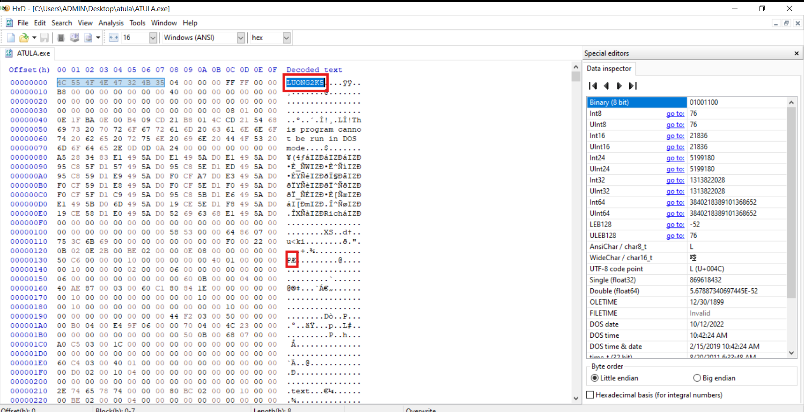
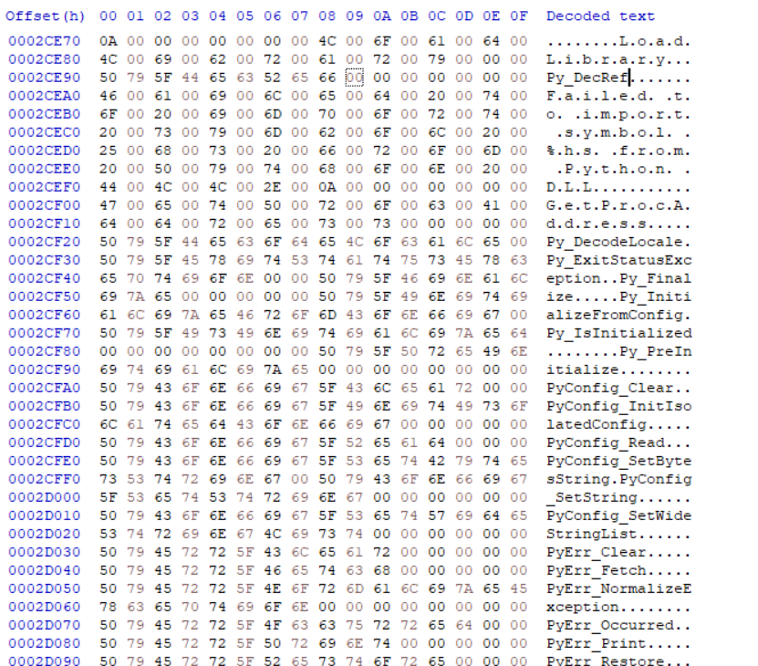
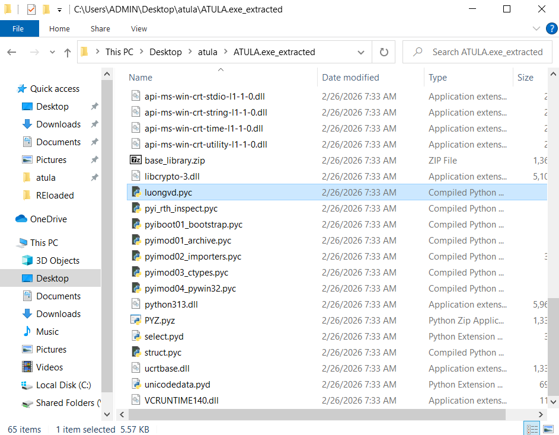
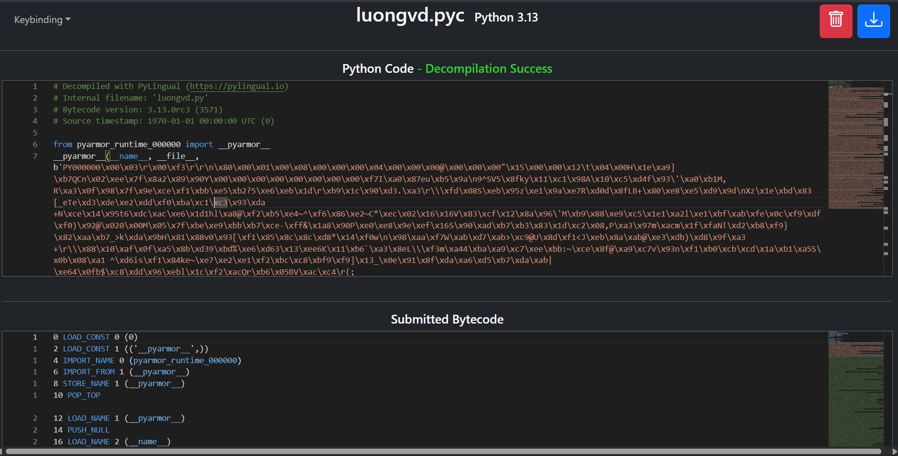
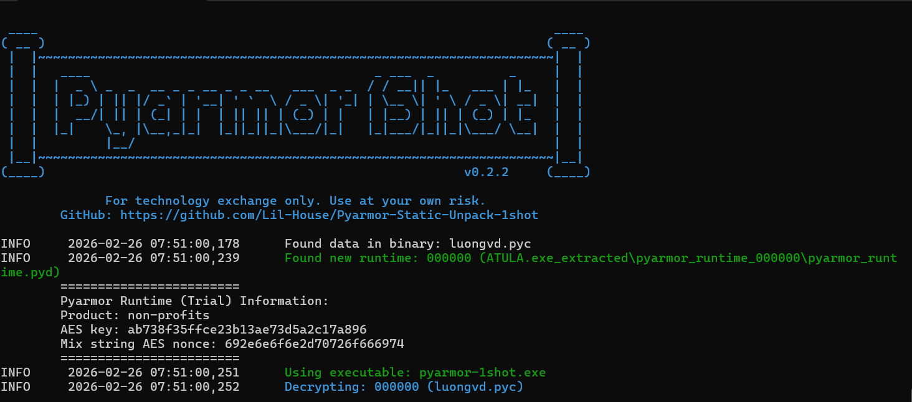
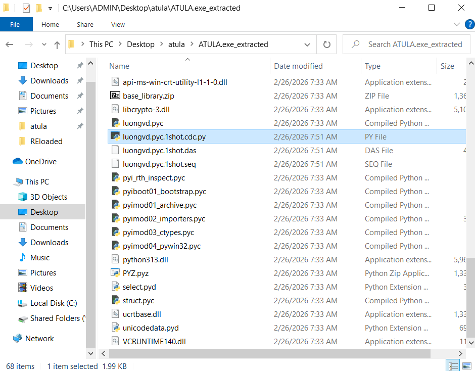

**LƯU Ý:**

Đây không phải write-up 100% tự làm. Tôi đang làm lại những bài mình còn bị mắc. Trong quá trình đó tôi có đọc write-up của những người khác và nhiều nguồn khác nữa. Đây giống như một bản note tôi viết để chính mình đọc và học hỏi từ các challenge cũ.

# ATULA
Challenge cung cấp một file hơn 600MB. File không chạy được, có lẽ đã bị hỏng.

`DiE` không nhận diện được file.



Bỏ vào `HxD` kiểm tra.



Có vẻ như Magic byte của DOS Header và PE Signature đã bị thay đổi.

Thử search string `py` để dò xem nó được compile bằng gì. Có vẻ như file được pack với `pyinstaller`.



Unpack bằng `pyinstxtractor`. Để ý rằng ta được file `luongvd.pyc`.



Decompile bằng `https://pylingual.io/`.



Source code đã bị obfucate bằng `pyarmor`. Unpack với `https://github.com/Lil-House/Pyarmor-Static-Unpack-1shot`.



Chúng ta có được các file sau.



Xem thử file `luongvd.pyc.1shot.cdc.py`.

```py
# File: luongvd.pyc.1shot.seq (Python 3.13)
# Source generated by Pyarmor-Static-Unpack-1shot (v0.2.2), powered by Decompyle++ (pycdc)

# Note: Decompiled code can be incomplete and incorrect.
# Please also check the correct and complete disassembly file: luongvd.pyc.1shot.das

'__pyarmor_enter_57797__(...)'
__assert_armored__ = '__pyarmor_assert_57796__'

def transform_char(c, position, seed):
    '__pyarmor_enter_57800__(...)'
    __assert_armored__ = '__pyarmor_assert_57799__'
    _var_var_0 = None(ord, c)
    _var_var_1 = _var_var_0 ^ position * 7 + seed
    return _var_var_1 % 26 + 65
    None(None)
    return None
    '__pyarmor_exit_57801__(...)'
    '__pyarmor_exit_57801__(...)'


def calculate_checksum(data):
    '__pyarmor_enter_57803__(...)'
    __assert_armored__ = '__pyarmor_assert_57802__'
    _var_var_2 = 4919
# WARNING: Decompyle incomplete


def generate_key(username):
    '__pyarmor_enter_57806__(...)'
    __assert_armored__ = '__pyarmor_assert_57805__'
    if None(len, username) < 3:
        return None
    return None
    _var_var_5 = None(len, username) * 13
    _var_var_1 = []
# WARNING: Decompyle incomplete


def verify_key(username, key):
    '__pyarmor_enter_57809__(...)'
    __assert_armored__ = '__pyarmor_assert_57808__'
    _var_var_13 = None(generate_key, username)
# WARNING: Decompyle incomplete


def main():
    '__pyarmor_enter_57812__(...)'
    __assert_armored__ = '__pyarmor_assert_57811__'
    None(print, 'Nhiệm vụ: Tìm key hợp lệ cho username của bạn')
    None(print, '  - Key có format: XXXX-XXXX-XXXX-XXXX')
    None(print, '------------------------------------------------------------')
    None(print, '\n[1] Nhập username và key để kiểm tra')
    None(print, '[2] Thoát')
    _var_var_14 = None(None(input, '\nLựa chọn: ').strip)
# WARNING: Decompyle incomplete

if __name__ == '__main__':
    pass
main()
return None
return None
'__pyarmor_exit_57798__(...)'
'__pyarmor_exit_57798__(...)'
```

Có vẻ như logic chính của chương trình vẫn không dịch được. Mở file `.das` để dịch từ file disassembly.

[luongvd.pyc.1shot.das](https://ideone.com/jWbsbx)

Sau một hồi ngồi dịch thì đây là mã gốc. Có thể bỏ vô A.I để dịch cho nhanh. Do đang luyện tập nên tôi ngồi dịch tay (khó thì vẫn A.I). Về cơ bản thì khá giống mã assembly.

```py
def transform_char(c, position, seed):
    _var_var_0 = ord(c)
    _var_var_1 = _var_var_0^((7*position)+seed)
    return _var_var_1%26+65


def calculate_checksum(data):
    _var_var_2 = 4919
    for _var_var_3, _var_var_4 in enumerate(data):
        _var_var_2 = ((_var_var_2<<3) | (_var_var_2>>13)) & 65535
        _var_var_2 ^= ((_var_var_3+1) * _var_var_4)
    
    return _var_var_2 & 65535


def generate_key(username):
    '__pyarmor_enter_57806__(...)'
    __assert_armored__ = '__pyarmor_assert_57805__'
    if len(username) < 3:
        return None
    _var_var_5 = len(username) * 13
    _var_var_1 = []
    for _var_var_3, _var_var_6 in enumerate(username.upper()):
        if _var_var_6.isalnum():
            _var_var_1.append(transform_char(_var_var_6, _var_var_3, _var_var_5))
    
    _var_var_7 = 0
    if len(_var_var_1) >= 4:
        _var_var_1 = _var_var_1[:4]
    for _var_var_3, _var_var_4 in enumerate(_var_var_1):
        _var_var_7 = (_var_var_7*31 + _var_var_4) & 65535
        
    _var_var_8 = calculate_checksum([ord(_var_var_6) for _var_var_6 in username])
    _var_var_9 = 57005
    _var_var_10 = ((_var_var_7^_var_var_8)^_var_var_9) & 65535
    _var_var_11 = ((_var_var_7+_var_var_8+_var_var_10) ^ 48879) & 65535
    _var_var_12 = f"{_var_var_7:04X}" + "-" + f"{_var_var_8:04X}" + "-" + f"{_var_var_10:04X}" + "-" + f"{_var_var_11:04X}"
    return _var_var_12


def verify_key(username, key):
    _var_var_13 = generate_key(username)
    if _var_var_13 == None:
        return False
    return key.upper() == _var_var_13.upper()

def main():
    print(generate_key("doituyenattt2026"))

if __name__ == '__main__':
    main()
```

Tôi đã lược bỏ mấy khúc ko cần thiết trong hàm main, vì mục tiêu chỉ cần lấy key. Username thì đã được cho sẵn trong đề bài là `doituyenattt2026`.

Flag: `InfosecPTIT{0C24-52B6-803F-61F6}`

References:
- https://hackmd.io/@3pWVxJ8vS8W8qn97pCONbg/SJXi3aIwbg
- https://gemini.google.com/share/57b4eaf886dd
