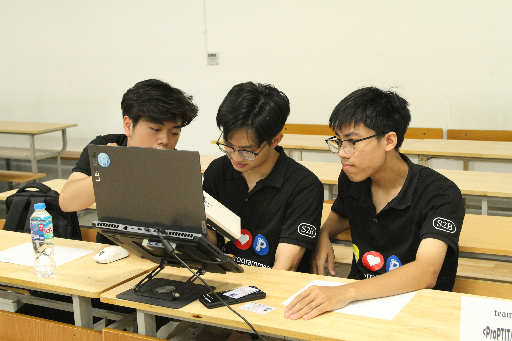

Chào mọi người, lại là mình đây!!!

Sau một khoảng thời gian rất lâu. Hôm nay mình mới nhớ lại là mình có một trang blog. Nên lọ mọ ngồi viết bài đây~. Nhân tiện thì mình là thằng ngồi giữa trong ảnh trên nhé :3.

# Năm cấp 3 của mình 🐧
Mình không phải đứa có nền toán quá mạnh. Các kiến thức cơ bản thì mình nắm kỹ, nhưng các kiến thức nâng cao thì mình chẳng có tẹo gì. Hồi cấp 2 mình có đăng ký thi HSG toán, hoá cấp huyện nhưng xếp bét cả huyện luôn 😭.
Vậy nên mình nghĩ lên cấp 3 mình sẽ không tham gia đội tuyển nào nữa. Tập trung học các môn tổ hợp để thi đại học thôi...

Nhưng mà như thế nào lại bén duyên với bộ môn lập trình thi đấu... Tại hồi đó cũng hay sửa fix lỗi trên máy tính cho các thầy cô (lỗi kiểu chiếu slide không được, không có âm thanh, màn hình slide bị bé...). Được cái chỗ mình cũng ít người rành công nghệ, máy tính các kiểu nên mình khá 'được biết đến' trong mảng này. Thế là cô giáo dạy môn Tin ở trường mình (cô Lương) chiêu mộ mình vào đội luôn lmao 🤣.

Do hồi c2 mình quá tự cao, thành ra không học hành ra hồn nên bị tụt lại so với ae trong đội. Lần này mình rút kinh nghiệm, mình vào với tâm thế của người chưa biết gì, sẵn sàng học mọi thứ từ đầu. Hè năm lớp 10 mình bắt đầu tới phòng Tin để học. Trong đội có 3 anh chị khác (1 anh thì sau này bỏ), mình là thành viên duy nhất 2k6. Mình được cô đưa cho quyển `Lập trình C++ cơ bản` để học. Sorry mn mình tìm lại không thấy nó đâu 😿. Mình tải `Code::Blocks` về. Mình bắt đầu mày mò mấy cái syntax cơ bản, biến, if-else các kiểu. Được cái là mình chỉ mất khoảng 1 tháng để hiểu được mấy cái này là gì. Tất nhiên chỉ là hiểu và ứng dụng mấy cái cơ bản thôi...

Sau đó cũng hết hè, vào năm học mình được làm quen với các chuyên đề. Và thứ đầu tiên mình được tiếp cận là **sàng nguyên tố**.

Cũng khá khoai, mình mất khoảng 1 tuần mới ngấm được cái này là cái gì. Còn để ứng dụng sâu thì chưa...

Sau đó mình được bắt đầu làm đề với anh chị, lúc đó mình cũng khá háo hức. Và kết quả là... 2/20 điểm... 😭🥀💔.

Thật ra mình cũng không thất vọng gì cả. Mình cũng lường trước được là mình sẽ được điểm thấp rồi. Mục tiêu của mình là tiếp cận với đề sớm để biết cách xử lý trong phòng thi. Và sau đó là chuỗi ngày luyện đề của mình.

Có thể bạn đã để ý, mình không có học theo chuyên đề mà bắt tay luyện đề luôn. Lý do vì phong trào lập trình ở chỗ mình rất yếu. Rất rất yếu! Cô giáo chưa có nhiều kinh nghiệm về bộ môn này (lần cuối có giải là giải Nhì năm 2019). Mình nói thế không phải để chê cô, mình rất quý cô luôn ấy. Cô dành tiền túi của cô để mua đề, mua tài liệu cho cả đội học. Cô luôn sát sao và quan tâm tới đội hết mức rồi.

Quay lại về việc luyện đề. Sau khi làm đề xong, mình luôn cố gắng hỏi lại 2 anh chị cách giải bài. Từ đó mình vỡ ra được rất nhiều điều (cảm ơn anh Thành và Trâm). Mục tiêu của mình là làm chuẩn chỉ 3 bài đầu, 2 bài cuối thì cắn test thôi. Rồi cuối cùng tới một ngày, mình cũng bắt kịp được với 2 anh chị.

Rồi ngày gần thi cũng đã tới. Cả đội tuyển sẵn sàng tâm thế để đi thi. Thực sự thì, theo mình đánh giá, đội Tin lúc đó là đội mạnh nhất của trường rồi (tiêu chí 'mạnh' ở đây là xét về khả năng có giải và nắm chắc kiến thức). Trong các đợt thi thử, 3 bọn mình đều trên 10 điểm (thang 20). Ý là, ít gì không có giải thì phải trên nửa điểm cho đỡ quê 🥀.

Và ngày thi đã tới, hôm đó phong độ của mình khá tốt. Mình ngồi làm được 3 bài đầu và cắn test 2 bài cuối đúng như kế hoạch. 2 anh chị thì làm chắc 2 bài đầu, bài 3 không chắc lắm, 2 bài cuối cũng cắn test giống mình.

Vào ngày trả điểm, đó cũng là 1 ngày rất đẹp trời. Tự nhiên mình được tin mình đạt giải ba (lúc đó cũng vui nhưng mình nhớ là mình không có hành vi quá khích nào cả lmao). Điểm của mình là 14.x/20. 2 anh chị thì được giải khuyến khích. Như vậy 100% thành viên đội mình có giải hehe.

Ngoài lề một chút thì mình là thành viên lớp 11 duy nhất của trường thi HSG tỉnh lúc đó. Sau khi đạt giải thì mình được bố mẹ thưởng cho chiếc PC đầu tiên, các bạn có thể xem lại posts trước...

Lên năm 12 thì mình tiếp tục thi đấu cho đội Tin. 2 anh chị đã tốt nghiệp rồi, đội mình cũng tuyển thêm các thành viên mới. Trong đó có nyc của mình (hồi đó chưa yêu nhau, thôi mình sẽ bàn chủ đề này trong post khác nhé) 😭. Thời gian nhanh như chos chạy ngoài đồng. Tóm tắt thì mình được giải Nhì năm nay. Ý là năm này thì cũng không có gì đặc biệt ấy. Tại mình chỉ hoài niệm năm 11 khi còn có 2 anh chị thôi.

# Lên đại học

Nhờ có giải tỉnh hồi c3 nên mình được tuyển vào PTIT mà không cần xét điểm THPT. Được 100% học bổng năm đầu luôn, quá ngon! Mình thì không thích học HUST vì học nặng toán quá, UET thì học phí đắt hơn PTIT. Mà lại có học bổng ở PTIT thì tội gì không vào. Dù sao mình cũng nghe tiếng trường khá nhiều. Mình chọn `An toàn thông tin`, vì CNTT nghe nói bão hoà mình cũng hơi rén... Lý do chính thì là mình thích danh xưng **Hacker Lỏd** này nọ các thứ 🤣.

Mình apply vào `CLB Lập trình PTIT`. Và quen được 2 god Đỗ Phạm Bảo Hoàng và Nguyễn Lê Minh (god Minh rời CLB để tập trung vào clb khác rồi 😭). Ba chúng mình tạo ra đội `<ProPTIT/> Tr0j4n`.

Ở CLB thì cũng được các anh chị đào tạo cho các kiến thức về học thuật, DSA bài bản hơn hồi c3. Cảm giác trình mình lên rõ rệt luôn ấy (cảm ơn ProPTIT).

Khi thi vòng loại của ICPC PTIT năm nay (2025). Team mình làm được 4/11 bài. Và bị loại... Khá suýt soát vì 5 bài là được vào rồi. Lên đại học mới thấy là nhiều thành phần quái vật lắm ae ạ. Đúng là mở mang tầm mắt luôn ấy. Dù bị loại nhưng đây cũng là trải nghiệm đáng nhớ và vui vẻ của mình và các đồng đội. Được kết nối với các đồng chí chung niềm đam mê đúng là không còn gì bằng. Vì hồi c3 ở cả trường chỉ mỗi mình đam mê máy tính và lập trình thôi. Ảnh cover cũng là ảnh hồi thi vòng loại của team mình đó.

_Từ trái sang: Minh, Hiếu, Hoàng._

Ngoài lề thì Bảo Hoàng hiện đang Intern AI R&D ở VNPT Cyber Immunity khi mới chỉ năm nhất.

Có lẽ mình sẽ tạm dừng cuộc chơi tại đây. Hiện tại mình muốn tập trung học các môn trên trường cũng như dấn thân vào `CTF`. Mình lâu lâu vẫn vô Codeforces hay LeetCode làm chơi chơi. Mà bên Discord của idol `Kunkka` có kênh DSA khá chất lượng. Trong đó có nhiều idol phết đấy.

Vậy thôi, bài này cũng khá dài rồi. Hẹn gặp lại ae trong một post khác nhé!

