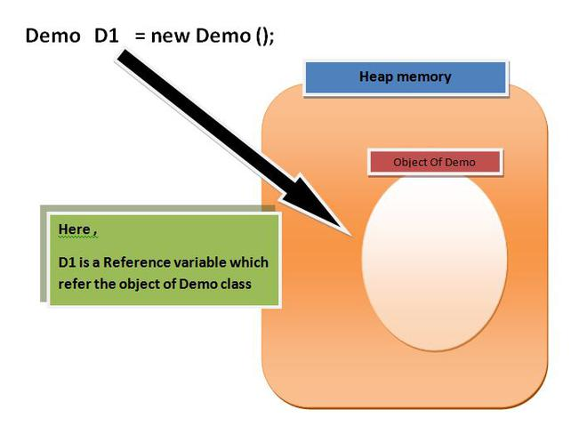
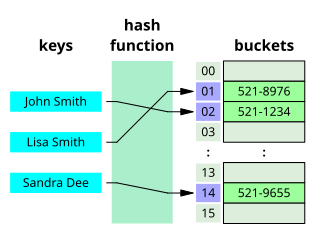
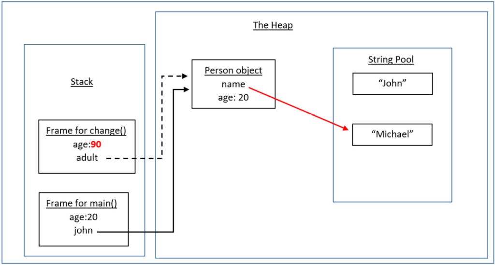

Haloo!  
Chào mọi người, hôm nay tiếp tục chuyên mục tự học Java nha. Buổi này ta sẽ cùng học về Object!  

**Buổi 2: Object**

**Mục lục**
- [I. Object là gì?](#i-object-là-gì)
  - [1. Khái niệm Object](#1-khái-niệm-object)
  - [2. Object lưu thế nào trong Java?](#2-object-lưu-thế-nào-trong-java)
- [II. Wrapper class.](#ii-wrapper-class)
- [III. Auto boxing / Auto unboxing.](#iii-auto-boxing--auto-unboxing)
  - [1. Auto boxing.](#1-auto-boxing)
  - [2. Auto unboxing.](#2-auto-unboxing)
- [IV. String và StringBuilder.](#iv-string-và-stringbuilder)
  - [1. String](#1-string)
  - [2. StringBuilder](#2-stringbuilder)
- [V. Về toán tử ==, equals(), hashcode().](#v-về-toán-tử--equals-hashcode)
  - [1. equals() và toán tử ==.](#1-equals-và-toán-tử-)
  - [2. hashcode.](#2-hashcode)
- [VI. Truyền tham số, pass by value.](#vi-truyền-tham-số-pass-by-value)
  - [1. Pass by value.](#1-pass-by-value)
  - [2. Tại sao pass by value mà String lại thay đổi được.](#2-tại-sao-pass-by-value-mà-string-lại-thay-đổi-được)
- [VII. Garbage Collector](#vii-garbage-collector)
- [Lời kết](#lời-kết)

## I. Object là gì?
### 1. Khái niệm Object
**Class và Object** là 2 khái niệm quan trọng bậc nhất trong lập trình hướng đối tượng. Để hiểu về Object, trước tiên ta cần hiểu đúng về class.
- Class là một khuôn mẫu để tạo ra các Object. Class định nghĩa tất cả các properties (thuộc tính), method (phương thức) của Object.
- Object là một thể hiện của Class. Mỗi Object đều phải thuộc một class nào đó. Tất cả các object thuộc về cùng một class thì có cùng các thuộc tính và phương thức.

Syntax khai báo một object theo một class:
```java
Example obj = new Example();
```
### 2. Object lưu thế nào trong Java?
Khi ta sử dụng từ khóa `new Example()` để tạo một object, bộ nhớ cho object đó được cấp trong vùng nhớ **Heap**. Heap là vùng nhớ động, dùng chung cho toàn bộ ứng dụng, và đối tượng tồn tại đến khi bị thu hồi bơi **Garbage Collector**.  
  

Biến tham chiếu đến đối tượng, ví dụ `Example obj` được lưu trong **Stack** (nếu là biến cục bộ) hoặc Heap (nếu là biến instance của một đối tượng khác).  
Ví dụ:
```java
public class Person {
    String name;
    int age;
}

public class Main {
    public static void main(String[] args) {
        Person person = new Person(); // Đối tượng lưu trong Heap, biến 'person' lưu trong Stack.
        person.name = "John";
        person.age = 25;
    }
}
```
Ở đây, `new Person()` mới là đối tượng thực tế được lưu trong **Heap**. Còn `person` thực chất chỉ là biến tham chiếu trỏ đến đối tượng `new Person()`

## II. Wrapper class.
**Wrapper class** trong Java là các class được cung cấp để chuyển đổi các kiểu dữ liệu nguyên thủy (primitive types) thành các object.  
- `byte`: `Byte`
- `short`: `Short`
- `int`: `Interger`
- `long`: `Long`
- `float`: `Float`
- `double`: `Double`
- `char`: `Character`
- `boolean`: `Boolean`

Tại sao cần Wrapper class?  
- Do các collection framework (ArrayList, HashMap, ...) chỉ làm việc với objects, không chấp nhận kiểu nguyên thủy.
- Cung cấp các method tiện ích. Ví dụ:  
  ```java
  String str = Interger.toString(123);
  ```
- Hỗ trợ giá trị null.
  ```java
  Integer value = null; // hợp lệ
  int value = null; // Lỗi compile
  ```

**Một số method thường dùng:**  
```java
Integer num = Integer.valueOf("123"); // String → Integer
int value = num.intValue();           // Integer → int
String str = num.toString();          // Integer → String
int max = Integer.MAX_VALUE;          // Giá trị lớn nhất
int parsed = Integer.parseInt("456"); // String → int

boolean isLetter = Character.isLetter('A');
boolean isDigit = Character.isDigit('5');
boolean isUpperCase = Character.isUpperCase('A');
char lowerCase = Character.toLowerCase('A');
```

## III. Auto boxing / Auto unboxing.
Auto boxing / Auto unboxing là cơ chế Java tự chuyển đổi giữa primitive types và wrapper class.
### 1. Auto boxing.
Chuyển primitive -> wrapper
```java
int num = 10;
Integer wrapped = num; // Tự động chuyển int thành Integer

// Tương đương với:
Integer wrapped = Integer.valueOf(num);
```
### 2. Auto unboxing.
Chuyển wrapper -> primitive
```java
Integer wrapped = 20;
int num = wrapped; // Tự động chuyển Integer thành int

// Tương đương với:
int num = wrapped.intValue();
```
## IV. String và StringBuilder.
### 1. String
String là một class trong Java, như C++, nó dùng để lưu một chuỗi các ký tự. String là một dạng **immutable**, tức là nó có tính **bất biến**, không thể thay đổi được. Tức là khi ta thay đổi giá trị của một String, ta đang tạo ra một String mới, và tham chiếu đến nó.  
```java
String str = "Hello World!";
str = "ProPTIT is Programming PTIT";
```
### 2. StringBuilder
Như đã nói ở trên, String là một dạng mutable, vì vậy sẽ có một số vấn đề. Cụ thể hơn, hãy xem xét ví dụ sau.  
```java
String res = "";
for(int i=0; i<=10000; ++i){
    res += String.valueOf(number);
}
```  
Với mỗi lần lặp, JVM không trực tiếp sửa chuỗi `res`. Thay vào đó nó tạo ra một object String mới với giá trị của `res` cũ cộng với `i`, rồi gán tham chiếu `res` vào object mới tạo này. Object cũ trở thành rác.  
**Hậu quả**: Ví dụ này tạo ra 10000 object trung gian, gây lãng phí tài nguyên bộ nhớ và thời gian xử lý.  
Để giải quyết vấn đề trên, Java cung cấp class **String Builder**.  
Giống như String, StringBuilder là class dùng để lưu trữ một chuỗi các ký tự. Nhưng nó là dạng **mutable**, tức là nó có tính **khả biến**, hay thay đổi được. Khi ta thay đổi giá trị của StringBuilder, ta không tạo ra StringBuilder mới, mà ta chỉ thay đổi giá trị của StringBuilder đó.  
```java
StringBuilder str = new StringBuilder("Hello World");
str.delete(5, 10); // "Hello"
str.append(" ProPTIT"); // "Hello ProPTIT"
str.insert(9, "gramming"); // "Hello ProgrammingPTIT"
```
## V. Về toán tử ==, equals(), hashcode().
Trong Java, có 2 cách so sánh object với nhau. Đó là dùng toán tử **==** như C/C++, và so sánh bằng hàm **equals()**. Vậy tại sao lại sinh ra 2 cách khác nhau làm gì vậy? Để hiểu rõ hơn, ta hãy tìm hiểu khái niệm của chúng.
### 1. equals() và toán tử ==.
Toán tử == so sánh **tham chiếu** - kiểm tra xem hai biến có trỏ đến cùng một object trong bộ nhớ không. Nếu 2 object có cùng địa chỉ, thì toán tử == sẽ trả về `true`, ngược lại sẽ trả về `false`.  
Còn với `equals()`, nó so sánh **nội dung** của object đó. Nếu 2 object có cùng nội dung, `equals()` trả về `true`, ngược lại trả về `false`.  
Do đó, các String có cùng 1 giá trị, nhưng dùng == để so sánh sẽ trả về `false`, còn dùng equals() thì trả về `true`. (như có nói ở trên, khi ta tạo một biến thì thực chất chỉ là một tham chiếu).  
Để rõ hơn ta có ví dụ:
```java
String str1 = "Hello";
String str2 = "Hello";
String str3 = new String("Hello");

System.out.println(str1 == str2); // true
System.out.println(str1 == str3); // false - khác đối tượng
System.out.println(str1.equals(str3)); // true - cùng nội dung
```
Tuy nhiên, lưu ý đoạn code sau:
```java
Integer a1 = 100;
Integer b1 = 100;
Integer a2 = 200;
Integer b2 = 200;

System.out.println(a1 == b1); // true - Java có cơ chế cached values (-128 đến 127)
System.out.println(a2 == b2); // false - khác đối tượng

```

### 2. hashcode.
`hashcode()` dùng để xác định vị trí của đối tượng đó trong một bảng băm (Hash Table).
  
Hash Table là một CTDL tương tự `unordered_map` trong C++. Nó dùng để lưu trữ vị trí các đối tượng một cách hiệu quả.

## VI. Truyền tham số, pass by value.
### 1. Pass by value.
Trong Java, khi ta truyền tham số **kiểu nguyên thủy** vào 1 hàm, tham số đó sẽ được copy ra một vùng nhớ khác, và hàm sẽ thao tác với tham số vừa được copy này. Vậy nên khi ta thay đổi giá trị của tham số trong hàm, giá trị của tham số ngoài hàm không bị thay đổi.  
```java
public class Main {
  public static void main(String[] args) {
    int a = 1;
    System.out.println(a); // 1
    change(a);
    System.out.println(a); // 1
  }

  public static void change(int a) {
    a = 2;
  }
}
```
Còn khi truyền tham chiếu vào hàm, tham chiếu đó sẽ được copy, và hàm sẽ thao tác với tham chiếu này. Vì đây là biến tham chiếu, nên khi thay đổi trạng thái object, object gốc cũng bị thay đổi theo.  
```java
class Person {
    String name;
    
    Person(String name) {
        this.name = name;
    }
}

public class ReferenceExample {
    public static void main(String[] args) {
        Person person = new Person("John");
        System.out.println("Trước khi gọi phương thức: " + person.name); // John
        
        changeName(person);
        
        System.out.println("Sau khi gọi phương thức: " + person.name); // Mike (đã thay đổi)
    }
    
    public static void changeName(Person p) {
        p.name = "Mike"; // Thay đổi trạng thái của đối tượng
    }
}
```
### 2. Tại sao pass by value mà String lại thay đổi được.

- Khi ta truyền vào một biến nguyên thủy, hay trong trường hợp trên là `age`, ta đang tạo một bản sao của biến này. Khi thay đổi giá trị của bản sao này, thì cũng không ảnh hưởng gì tới bản gốc cả.  
- Tuy nhiên, khi ta truyền vào một biến tham chiếu của object `person`, ta đang tạo bản sao của biến tham chiếu đó, và nó vẫn trỏ về object gốc trên **Heap**. Vì vậy, khi thay đổi trạng thái biến copy này, object gốc cũng bị thay đổi. Điều đó lý giải vì sao pass-by-value mà String lại thay đổi được.
## VII. Garbage Collector
Trong quá trình thực thi, Java sẽ liên tục tìm các object không được tham chiếu tới **Heap** (mang giá trị `null`, out of scope, ...). Sau đó, **Garbage Collector** sẽ tự động giải phóng bộ nhớ cho các ô nhớ chứa tham chiếu đó. Như vậy, Java đã tự động hóa việc giải phóng bộ nhớ nhờ cơ chế **Garbage Collector**.
```java
public class GarbageCollectionExample {
    public static void main(String[] args) {
        // Object có reference
        Object obj1 = new Object();
        
        // Object mất reference, có thể bị GC
        obj1 = null;
        
        // Object trong block scope
        {
            Object obj2 = new Object();
        } // obj2 mất reference khi ra khỏi block
    }
}
```
## Lời kết
Oke! Buổi hôm nay tới đây thôi nha.  
Như mọi khi, mình biết mình trình bày hơi lỏd, mn cố gắng tìm thêm nguồn đọc để hiểu nha. Cảm ơn mn vì đã đọc 😭🥀.