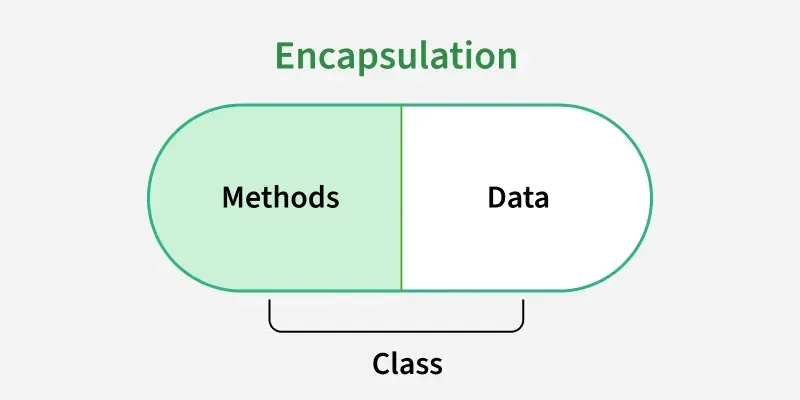
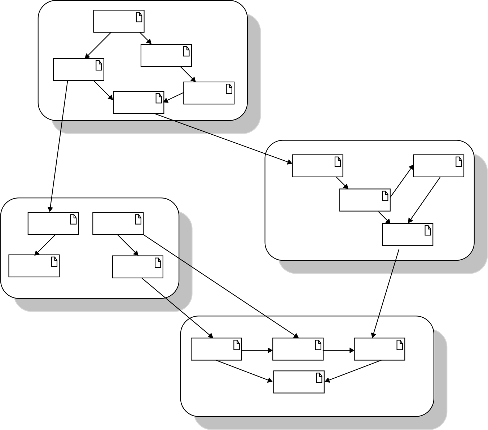
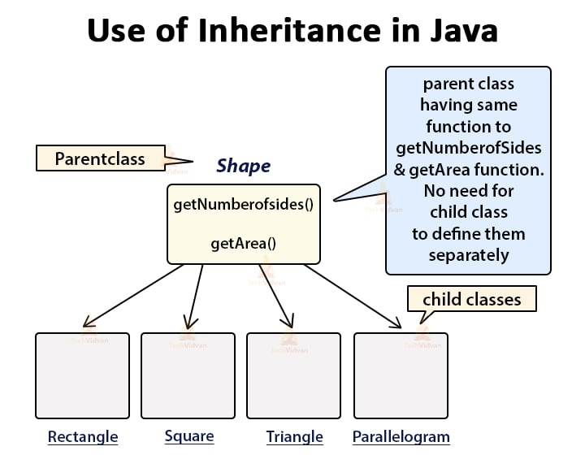
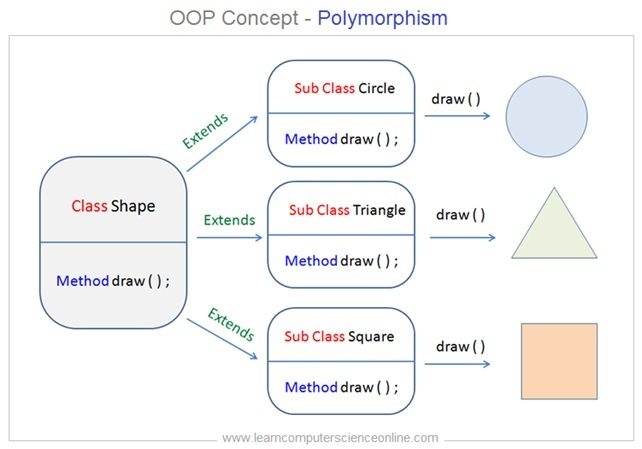

Halo halo! Lại là mình đây. Hôm nay tiếp tục đến với chuyên đề Java Core thứ 3 nha. Thực sự là mấy tuần qua mình mải cày alime quá nên cũng suýt quên mất là mình có cái blog 😭🥀. Btw các bạn nếu thích thú thì xem thử **Kamisama ni natta hi** và **Angel Beat** nha (Angel Beat thì quá nổi rồi mà bây giờ mình mới xem...). Oke, không dài dòng nữa, vào bài!

- [I. Tính đóng gói.](#i-tính-đóng-gói)
- [II. Tính kế thừa.](#ii-tính-kế-thừa)
  - [1. Khái niệm, syntax.](#1-khái-niệm-syntax)
  - [2. Đặc điểm của tính kế thừa.](#2-đặc-điểm-của-tính-kế-thừa)
  - [3. Constructor trong kế thừa.](#3-constructor-trong-kế-thừa)
  - [4. Variable hiding.](#4-variable-hiding)
  - [5. Đa kế thừa.](#5-đa-kế-thừa)
- [III. Upcasting và Downcasting.](#iii-upcasting-và-downcasting)
  - [1. Upcasting.](#1-upcasting)
  - [2. Downcasting.](#2-downcasting)
- [IV. Class Object.](#iv-class-object)
- [V. Tính đa hình.](#v-tính-đa-hình)
  - [1. Khái niệm.](#1-khái-niệm)
  - [2. Đa hình tĩnh.](#2-đa-hình-tĩnh)
  - [3. Đa hình động.](#3-đa-hình-động)

# I. Tính đóng gói.
**Đóng gói (Encapsulation)** là che giấu các thuộc tính của đối tượng, chỉ cho phép tương tác với đối tượng qua các phương thức do mình lập trình.  
Thật ra, việc sử dụng **Getter và Setter** cũng là một cách **đóng gói**.  
  
**Lý do cần đóng gói:**  
- Giảm sự phức tạp mã nguồn, giúp dễ bảo trì và sửa lỗi.
- Đảm bảo tính toán vẹn của dữ liệu, do chỉ có thể tương tác với object qua method chứ không thể tương tác trực tiếp.  

Ví dụ về đóng gói:
```java
class Programmer {

    private String name;

    public String getName() { return name; }

    public void setName(String name) {
        this.name = name;
    }
}

public class Geeks {

    public static void main(String[] args){
        
        Programmer p = new Programmer();
        p.setName("Hieu LD");
        System.out.println("Name: " + p.getName());
    }
}
```  

Việc đóng gói và phân tách công năng của chương trình ra thành các **module** nhỏ là cực kỳ quan trọng. Như vậy, khi cần thêm, xoá, sửa tính năng nào đó, ta sẽ không quá lo việc này sẽ ảnh hưởng tới những phần khác trong chương trình.  

  

# II. Tính kế thừa.
## 1. Khái niệm, syntax.
**Kế thừa (Inheritance)** giúp ta sử dụng lại đặc tính của một object khác mà không cần tạo class mới hoàn toàn. Giúp giảm sự lặp lại mã nguồn, dễ bảo trì và mở rộng chương trình hơn.  
Kế thừa giúp ta tạo class mới dựa trên class đã có, và có thể thêm, sửa các đặc tính mới nữa.  
  
Syntax:
```java
class SuperClass {
    // thuộc tính và phương thức
}

class SubClass extends SuperClass {
    // thêm hoặc ghi đè phương thức
}
```  

**Ví dụ:**  

```java
class Animal {
    void eat() {
        System.out.println("Eating...");
    }
}

class Dog extends Animal {
    void bark() {
        System.out.println("Barking...");
    }
}

public class Main {
    public static void main(String[] args) {
        Dog d = new Dog();
        d.eat(); // kế thừa từ Animal
        d.bark(); // phương thức riêng của Dog
    }
}
```  

## 2. Đặc điểm của tính kế thừa.
- Mỗi class chỉ có một class cha, tức là chỉ kế thừa từ một class.
- Class con kế thừa **tất cả** thành viên không private của class cha. Bao gồm biến, methods, **nhưng không kế thừa Constructor**. Vẫn có thành viên private, nhưng chúng bị ẩn và không thể truy cập trực tiếp.
- Lớp con có thể **ghi đè (Override)** phương thức lớp cha. Dùng khi muốn thay đổi hành vi (Ví dụ: chó và mèo đều là động vật, nhưng chúng kêu khác nhau).  

## 3. Constructor trong kế thừa.
Constructor không được kế thừa, nhưng lớp con có thể gọi constructor của lớp cha bằng `super()`.  
Lời gọi `super()` phải nằm ở dòng đầu tiên trong constructor của lớp con.  
Nếu không gọi `super()`, Java tự động gọi constructor không tham số của lớp cha.  
Ví dụ:  
```java
class Animal {
    Animal() {
        System.out.println("Animal constructor");
    }
}

class Dog extends Animal {
    Dog() {
        super(); // gọi constructor của Animal
        System.out.println("Dog constructor");
    }
}

public class Main {
    public static void main(String[] args) {
        Dog d = new Dog();
    }
}
```
**Kết quả:**  
```
Animal constructor
Dog constructor
```  
## 4. Variable hiding.
Khi lớp con khai báo lại một biến trùng tên với biến của lớp cha, biến của lớp con **che khuất (hide)** biến của lớp cha.  
Khác với override (chỉ áp dụng cho phương thức), **variable hiding** chỉ xảy ra với thuộc tính, **không có tính đa hình**.  
Ví dụ:  
```java
class Parent {
    int x = 10;
}

class Child extends Parent {
    int x = 20;
}

public class Main {
    public static void main(String[] args) {
        Child c = new Child();
        System.out.println(c.x);       // 20
        System.out.println(((Parent)c).x); // 10
    }
}
```  

## 5. Đa kế thừa.
**Đa kế thừa** là việc một thực thể con được kế thừa từ nhiều thực thể cha.  
Java **không cho phép đa kế thừa bằng class**. Thay vào đó, Java hỗ trợ đa kế thừa bằng `interface`. Sở dĩ như vậy bởi vì Java tránh xung đột phương thức cùng tên.  

# III. Upcasting và Downcasting.
## 1. Upcasting.
**Upcasting** là việc ép kiểu từ lớp con → lớp cha (subclass → superclass).  
Đây là **ép kiểu ngầm định (implicit casting)**, luôn an toàn vì lớp con là một loại của lớp cha.  
Ví dụ:
```java
class Animal {
    void makeSound() {
        System.out.println("Animal sound");
    }
}

class Dog extends Animal {
    void makeSound() {
        System.out.println("Bark");
    }
    void wagTail() {
        System.out.println("Wagging tail");
    }
}

public class Main {
    public static void main(String[] args) {
        Dog d = new Dog();
        Animal a = d; // Upcasting: Dog → Animal
        a.makeSound(); // Gọi phương thức bị override → "Bark"
        a.wagTail(); //Lỗi, vì lớp Animal không có wagTail()
    }
}
```
**Giải thích:**  
- Khi upcast, đối tượng vẫn là Dog, nhưng trình biên dịch chỉ biết đến kiểu Animal, nên chỉ gọi được các phương thức có trong Animal.  
- Tuy nhiên, nếu phương thức bị override, Java sẽ gọi phiên bản của lớp con (Dog) → đây là **đa hình động (dynamic polymorphism)**.

## 2. Downcasting.
**Downcasting** là việc ép kiểu ngược lại: từ lớp cha → lớp con.  
Khác với upcasting, downcasting không an toàn, có thể gây lỗi `ClassCastException` nếu đối tượng không thực sự là instance của lớp con.  
Ví dụ:  
```java
Animal a = new Dog(); // Upcasting
Dog d = (Dog) a;      // Downcasting: Animal → Dog
d.wagTail();          // OK
```
Nhưng nếu object thật sự không phải `Dog`:  
```java
Animal a = new Animal();
Dog d = (Dog) a;  // Lỗi runtime: ClassCastException
```
Trước khi downcast, nên dùng toán tử `instanceof` để kiểm tra kiểu thực tế của đối tượng.  
```java
Animal a = new Animal();

if (a instanceof Dog) {
    Dog d = (Dog) a;
    d.wagTail();
} else {
    System.out.println("Không thể ép kiểu về Dog");
}
```
# IV. Class Object.
**Object** là **lớp cha gốc (root class)** của mọi lớp trong Java.  
Tất cả các lớp — dù là bạn tự định nghĩa hay có sẵn trong thư viện Java — đều trực tiếp hoặc gián tiếp kế thừa từ `java.lang.Object`.  
Cụ thể hơn, hãy xét ví dụ sau:
```java
class MyClass {
    // ngầm định: extends Object
}
```
Đoạn mã trên tương đương với:
```java
class MyClass extends Object {
    // ...
}
```
Khi lập trình, ta không cần ghi rõ, mà Java tự động thêm phần này.  
Một số method quan trọng của `Object`.
Phương thức	Ý nghĩa
- `toString()`: Trả về chuỗi mô tả đối tượng (thường dùng khi in ra).
- `equals(Object obj)`: So sánh hai đối tượng có “bằng nhau” không.
- `hashCode()`: Trả về mã băm (hash code) của đối tượng.
- `getClass()`: Trả về đối tượng Class mô tả kiểu runtime của đối tượng.
- `clone()`: Tạo bản sao (shallow copy) của đối tượng (nếu Cloneable).
- `finalize()`: Được gọi trước khi đối tượng bị thu hồi bởi Garbage Collector (hiện nay gần như không dùng).
- `wait(), notify(), notifyAll()`: Dùng trong lập trình đa luồng (thread synchronization).

# V. Tính đa hình.
## 1. Khái niệm.
**Tính đa hình (Polymorphism)** là khả năng một hành động có thể được thực hiện theo nhiều cách khác nhau.  
Trong Java, đa hình cho phép cùng một phương thức có thể hành xử khác nhau tùy theo đối tượng thực tế đang gọi nó.  
*“Một tên phương thức – nhiều hành vi khác nhau.”*  

  

## 2. Đa hình tĩnh.
**Đa hình tĩnh** Là khi nhiều phương thức cùng tên nhưng khác danh sách tham số (số lượng, kiểu, hoặc thứ tự tham số) -> Quyết định phương thức nào được gọi diễn ra ngay khi biên dịch (compile-time).  
Kỹ thuật tạo ra nhiều phương thức cùng tên, nhưng khác nhau về tham số truyền vào này gọi là **overload**.  
**Overload** giúp ta có thể sử dụng các phương thức khác nhau, nhưng có cùng một tên, và khi gọi các phương thức, ta sẽ thấy mỗi phương thức sẽ thực hiện theo cách của nó, chứ không phải cách của phương thức khác.
Ví dụ:  
```java
class MathUtil {
    int add(int a, int b) {
        return a + b;
    }
    double add(double a, double b) {
        return a + b;
    }
    int add(int a, int b, int c) {
        return a + b + c;
    }
}

public class Main {
    public static void main(String[] args) {
        MathUtil m = new MathUtil();
        System.out.println(m.add(2, 3));       // Gọi hàm int
        System.out.println(m.add(2.5, 3.2));   // Gọi hàm double
        System.out.println(m.add(1, 2, 3));    // Gọi hàm 3 tham số
    }
}
```
## 3. Đa hình động.  
Là khi lớp con **ghi đè (override)** lại phương thức của lớp cha, và phương thức nào được gọi phụ thuộc vào đối tượng thực tế tại run-time (chứ không phải kiểu biến tham chiếu).  
Kỹ thuật **override** giúp ta có thể thay đổi cách thức hoạt động của một phương thức đã có sẵn trong class cha.  
Ví dụ:  
```java
class Animal {
    void sound() {
        System.out.println("Animal makes a sound");
    }
}

class Dog extends Animal {
    @Override
    void sound() {
        System.out.println("Dog barks");
    }
}

class Cat extends Animal {
    @Override
    void sound() {
        System.out.println("Cat meows");
    }
}

public class Main {
    public static void main(String[] args) {
        Animal a1 = new Dog();  // Upcasting
        Animal a2 = new Cat();
        a1.sound(); // Dog barks
        a2.sound(); // Cat meows
    }
}
```


